# Study plan: 10 sessions

↑ [[00-START-HERE]] · ← [[01-environment-setup]] · Türkçe: [[02-calisma-plani]]

**Order:** visual intuition (1) → numerical evidence (2–3) → complex plane
(4–7) → physics (8–9) → formal proof (10). About 11 hours in total.

**Rule:** answer each session's questions **yourself first**. The answers
are at the end, under [[#Answers]].

**Conventions:** commands are given from the repo root. On Windows you may
use `\` instead of `/`; PowerShell accepts both. You can open a
[[_templates/session-log|session log]] at the end of each session.

> [!warning] Outputs get rewritten
> The Python scripts regenerate `out/tablolar/` and `out/gorseller/`. When
> you are done, check `git status`, and use `git restore out/` if you do not
> want the changes.

| # | Session | Time | Layer |
|---|---|---|---|
| 1 | [[#Session 1 — Where does the polynomial let go?]] | 40 min | web, manim |
| 2 | [[#Session 2 — The Taylor core]] | 60 min | python, theory |
| 3 | [[#Session 3 — The Lagrange remainder is an equality]] | 90 min | manim, python |
| 4 | [[#Session 4 — One dimension up]] | 45 min | manim, web |
| 5 | [[#Session 5 — Reading the disk from data]] | 75 min | python, octave |
| 6 | [[#Session 6 — Reading the radius from coefficients]] | 60 min | python |
| 7 | [[#Session 7 — Converging is not being equal]] | 45 min | manim, python |
| 8 | [[#Session 8 — The dropped term returns in the period]] | 90 min | python, web, godot, manim |
| 9 | [[#Session 9 — Quantization is born from truncation]] | 60 min | python |
| 10 | [[#Session 10 — The formal layer]] | 90 min | lean |

---

## Session 1 — Where does the polynomial let go?

**Time:** 40 min

**Goal:** see that increasing $N$ grows the good region, that beyond a
boundary it stops helping, and where the $n!$ in the coefficient comes from.

**Run:**

```powershell
python -m http.server 8765
# browser: http://localhost:8765/06-web/index.html
```

**Look at:**

1. Web → **1 · Yaklaşım ve hata** (approximation and error). Pick
   `1/(1+x²)`, tick "Yakınsaklık aralığını göster" (show interval of
   convergence), and slide $N$ from 2 to 30. In the cards below, watch
   **hata, diskin içinde** (error inside the disk) shrink and **hata, diskin
   dışında** (error outside) grow.

   

2. Repeat with `sin x`: no wall any more, but for every $N$ the curve still
   runs away somewhere.
3. Video 1 (25 s): the "geçerli bölge" (valid region) readout is $|x|<0.6$ at
   $N=1$ and $|x|<6.1$ at $N=15$.

   [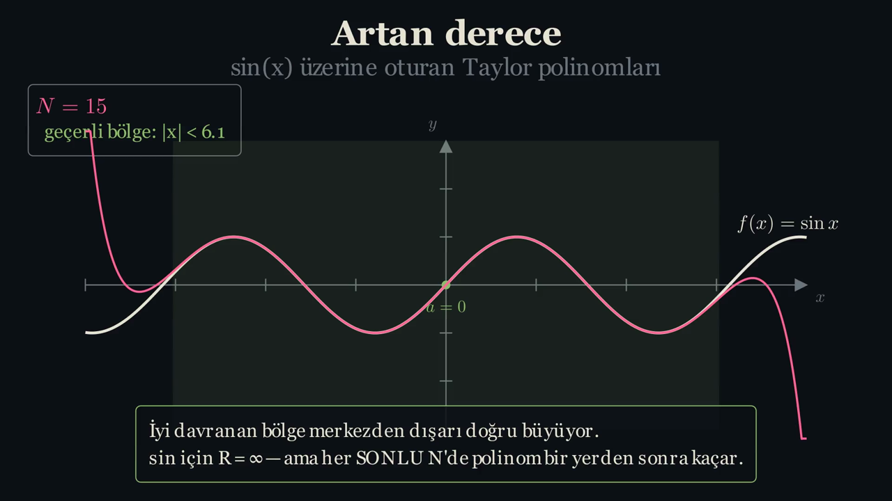](../../../out/videolar/1-ArtanDereceSahnesi.mp4)
   ![[1-ArtanDereceSahnesi.mp4]]

4. Video 2 (40 s): notice which terms die when you set $x=a$.

   [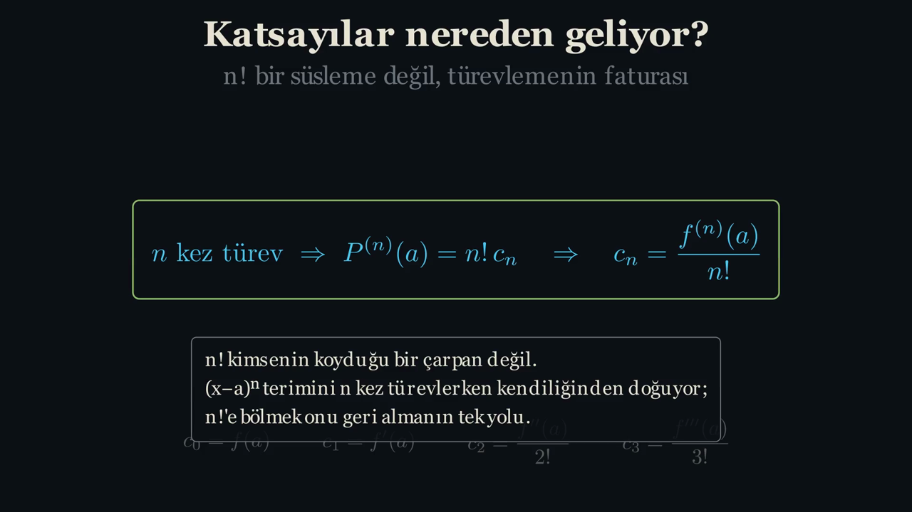](../../../out/videolar/2-TuretmeSahnesi.mp4)
   ![[2-TuretmeSahnesi.mp4]]

**Read:**

- `01-manim/scenes/s01_artan_derece.py` → `iyi_bolge()` (definition of the
  "valid region") and `sin_taylor()`.
- `out/taylor-teori.pdf` §1: the proposition $P^{(n)}(a)=n!\,c_n$ and its proof.
- Atomic note: [[Taylor açılımı bir tanım değil zorunluluktur]].

**Ask yourself:**

1. For $\sin$, $R=\infty$. Why does the polynomial still escape at every finite $N$?
2. `1/(1+x²)` is perfectly smooth on the real line. Can anything on the real
   line explain a wall at $|x|=1$?
3. Where does the $n!$ in $c_n=f^{(n)}(a)/n!$ come from? One sentence.
4. Is the video's "valid region" a metaphor or a measured number?

---

## Session 2 — The Taylor core

**Time:** 60 min

**Goal:** know `taylor.py`, the module the whole numerical layer rests on,
line by line.

**Run:**

```powershell
python 02-python\src\taylor.py
```

**Look at:** the output prints four blocks: `sin` coefficients, the `exp`
derivative check, `sin, a=0, N=5: aday ihlal=0, en kötü oran=0.2704`
(candidate violations = 0, worst ratio = 0.2704) and C-H/ratio estimates for
three functions. The last line must be `Tüm kontroller geçti.` Note this
line: `exp: C-H R≈7.9289  oran R≈30.0000  teorik R=inf`.

**Read** (`02-python/src/taylor.py`):

- `taylor_katsayilari()`: produces coefficients **by differentiating**.
- `polinom_fonksiyonu()`: sympy → numpy.
- `KalanRaporu`: the fields `aday_sayisi` (candidate count),
  `yuvarlama_sayisi` (rounding-regime count), `en_kotu_oran` (worst ratio).
- `lagrange_sinir()`: $O(M+P)$ bound via `np.maximum.accumulate`.
- `cauchy_hadamard_R()` and `oran_testi_R()` (ratio test).
- The `if __name__ == "__main__":` block at the bottom (tests).
- Details: [[03-layer-python]].

**Ask yourself:**

1. Why does `taylor_katsayilari` avoid `sp.series`?
2. Why may `lagrange_sinir` use a cumulative maximum? What observation is it based on?
3. For `exp`, C-H gives $\approx 7.93$ and the ratio test gives $30$, while the
   true $R=\infty$. Is that a bug?
4. What do `aday_sayisi` and `yuvarlama_sayisi` measure?

---

## Session 3 — The Lagrange remainder is an equality

**Time:** 90 min

**Goal:** see why the points float64 calls "violations" are not theorem
violations, and that $\xi$ can really be found.

**Run:**

```powershell
python 02-python\src\kalan_dogrulama.py      # ~12 s, rewrites out\
```

Then inspect the most suspicious row yourself. In `02-python/src`, start
`python` and paste:

```python
import numpy as np, sympy as sp, taylor as T
e = sp.log(1 + T.x); x = np.linspace(-0.85, 2.0, 1501)
r = T.kalan_raporu(e, 0.0, 7, x)
meaningful = np.isfinite(r.gercek_hata) & (r.lagrange_sinir > r.yuvarlama_tabani)
ratio = np.where(meaningful, r.gercek_hata / np.where(r.lagrange_sinir > 0, r.lagrange_sinir, 1), 0)
i = int(np.argmax(ratio)); print(x[i], ratio[i], r.gercek_hata[i], r.lagrange_sinir[i])
m = T.yuksek_hassasiyet_sadece_hata(e, 0.0, 7, float(x[i])); print("mpmath ratio:", m / r.lagrange_sinir[i])
```

Expected: `x ≈ 0.0126`, float64 ratio `2.359…`, mpmath ratio `0.9889…`.

**Look at:**

- `out/tablolar/kalan_dogrulama.md`: the columns **float64 aday ihlal**
  (float64 candidate violations), **en kötü oran** (worst ratio) and
  **yuvarlama rejimi** (rounding regime); in the second table, **float64
  oran** next to **mpmath oran**.
- `out/tablolar/ksi_varligi.md` (existence of ξ): the last row (`ln(1+x)`, `x=1.8`).
- `out/gorseller/kalan_dogrulama.png`: the grey band is float64's measurement floor.

  

- Video 3: at $N=10$, $x=2$ the ratio is $0.9748$, so the bound is sharp.

  [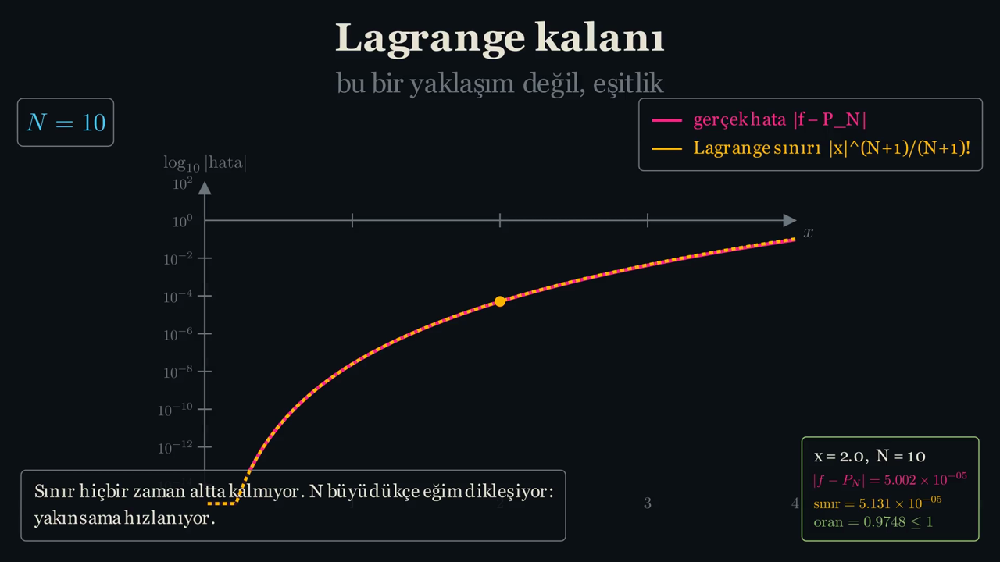](../../../out/videolar/3-KalanTerimiSahnesi.mp4)
  ![[3-KalanTerimiSahnesi.mp4]]

**Read:**

- `taylor.py` → `kalan_raporu()` (note the `exp, a=1, N=12, x=0.996` example in the docstring).

  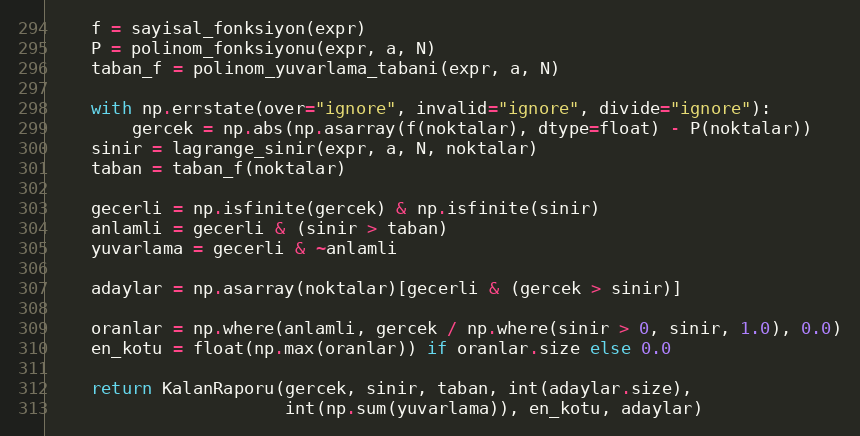

- `taylor.py` → `_mpmath_katsayilari()` (why `sp.Rational(a)`?) and
  `yuksek_hassasiyet_sadece_hata()`.
- `kalan_dogrulama.py` → `adaylari_teyit_et()` (confirm candidates), `ksi_bul()` (find ξ).

  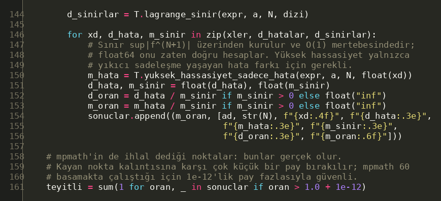

- In depth: [[10-seven-results#1. The Lagrange bound was never violated]]
  and [[10-seven-results#2. ξ really exists — even outside the radius]].

**Ask yourself:**

1. The table shows a "worst ratio" of 2.3593 for `ln(1+x)`. Was the theorem broken?
2. The bound is computed in float64. Why does the error need mpmath?
3. `x=1.8` lies outside $R=1$. Why does $\xi$ still exist there?
4. `ksi_bul` returns one $\xi$. Is $\xi$ unique?

---

## Session 4 — One dimension up

**Time:** 45 min

**Goal:** see with your own eyes that the radius of convergence is the
distance from the centre to the nearest **complex** singularity.

**Run:** the server from session 1. Web → **2 · Kompleks disk** (complex disk).

**Look at:**

1. `1/(1+x²)`, $N=28$. Move `Merkez Re(a)` (centre, real part) 0 → 1 → 2 and
   compare the cards **teorik R** (theoretical R) and **haritadan okunan R**
   (R read from the map). At $a=1$:

   

2. Set `Merkez Im(a)` to $+0.5$. What does the disk do?
3. Choose `ln(1+x)`, raise $N$ from 4 to 48: the white boundary is flattened
   towards the left.
4. Choose `eˣ`: there is no boundary.
5. Video 4 (58 s), the most important one.

   [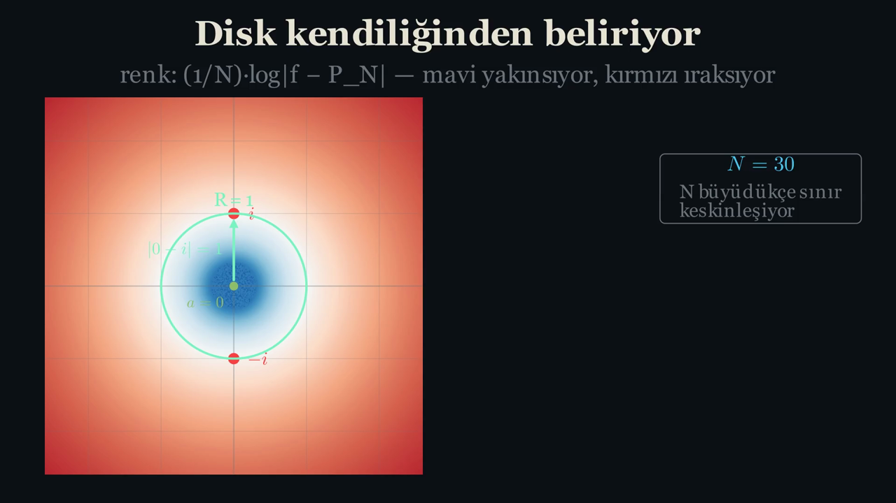](../../../out/videolar/4-KompleksYaricapSahnesi.mp4)
   ![[4-KompleksYaricapSahnesi.mp4]]

   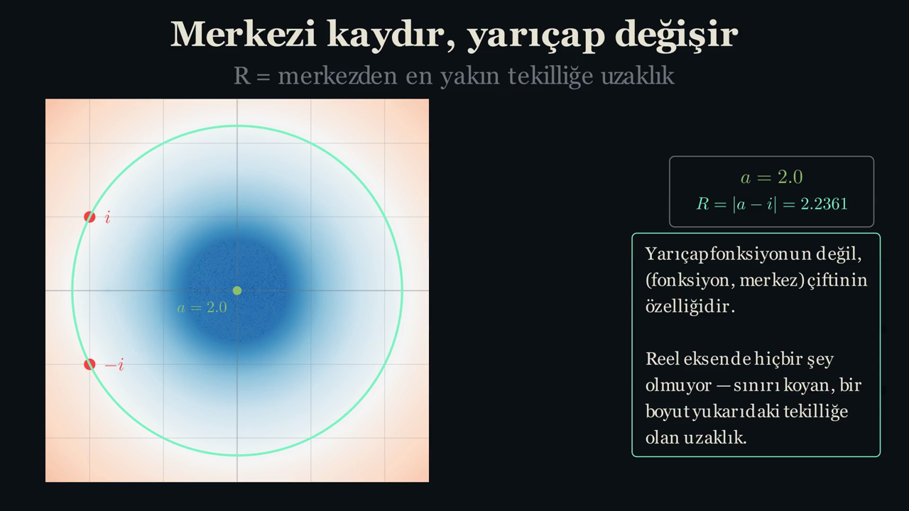

**Read:**

- `out/taylor-teori.pdf` §3: the theorem "radius = distance to nearest
  singularity" and the "Merkezi kaydırmak" (shifting the centre) table.
- Atomic note: [[Yakınsaklık yarıçapı kompleks düzlemde belirlenir]].

**Ask yourself:**

1. How does $R$ change when `Im(a)` is non-zero?
2. Why is $R=1$ for `1/(1+x²)` at $a=0$?
3. Why is "sonlu N sapması" (finite-N deviation) always negative?
4. Why is there no boundary line for `eˣ`?

---

## Session 5 — Reading the disk from data

**Time:** 75 min

**Goal:** confirm in two independent implementations (Python and Octave)
that the disk is not drawn but emerges from the sign of the error itself.

**Run:**

```powershell
python 02-python\src\kompleks_harita.py
cd 03-matlab-octave; & $oct --no-gui --quiet demo_calistir.m; cd ..
```

(For `$oct` see [[01-environment-setup#Octave]]; on Linux use `octave-cli`.)

**Look at:**

- `out/gorseller/kompleks_hata_haritasi.png`: black contour = the map's own
  zero level, dashed green = theoretical circle.

  

- `out/gorseller/reel_eksende_ipucu_yok.png` ("no clue on the real axis") and `yaricap_gecisi.png`.
- `out/tablolar/kompleks_yaricap.md`: **teorik R** and **haritadan okunan R**.
- Octave output §1: at $x=0.5$ the error falls with $N$; at $x=1.5$ it grows.
- Octave output §3: the columns **okunan R** (read R), **sapma** (deviation) and **python** side by side.

**Read:**

- `kompleks_harita.py` → docstring of `hata_haritasi()` (why divide by $N$).
- `kompleks_harita.py` → `yaricapi_haritadan_kestir()` (estimate the radius from the map).

  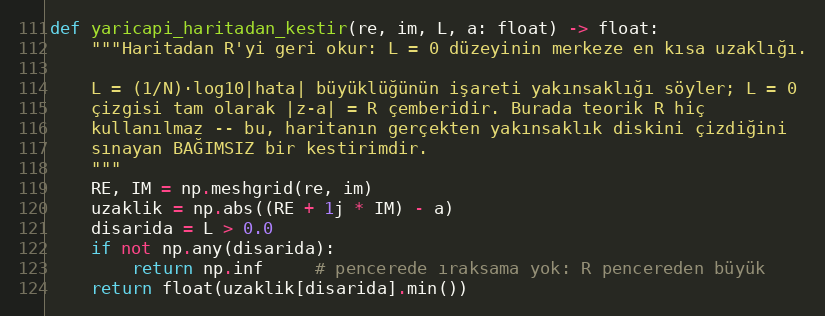

- `03-matlab-octave/yakinsaklik_diski.m` (sign-changing pixels) and
  `taylor_katsayilari.m` → `case '1/(1+x^2)'` (closed form via partial fractions).

**Ask yourself:**

1. Why does $\frac1N\log_{10}|f-P_N|$ tend to $\log_{10}(|z-a|/R)$?
2. For `1/(1-z)` the read radius is $0.9219$. Why not 1, and why is the
   shortest distance specifically in the direction of $z=1$?
3. Octave reads 0.9165, Python 0.9219. Which one is "right"?
4. In Octave §1 at $x=1.5$, what does raising $N$ from 4 to 64 achieve?

---

## Session 6 — Reading the radius from coefficients

**Time:** 60 min

**Goal:** understand why Cauchy–Hadamard is stated with **limsup** rather
than a limit, and what finite data can and cannot show.

**Run:**

```powershell
python 02-python\src\yakinsaklik_orani.py
```

Look at the "Oran testinin salınımı" (oscillation of the ratio test) part of
the output. Then, in `02-python/src`, open `python` and see what happens
when the coefficients are produced **with a floating-point centre**, as the
previous version of the script did:

```python
import numpy as np, sympy as sp, taylor as T
e = 1/(1 + T.x**2)
exact = T.katsayi_dizisi(e, 1.0, 60)                                     # exact arithmetic now
floaty = np.array([float(c) for c in T.taylor_katsayilari(e, 1.0, 60)])  # old way
print("c_60  exact:", exact[60], " float:", floaty[60])
print("ratio test  exact:", T.oran_testi_R(exact), " float:", T.oran_testi_R(floaty))
```

Expected: `c_60` is `-4.66e-10` exactly but `+2.55e-09` in floating point;
the ratio test gives `1.4142` with exact and `1.0938` with float coefficients.

**Look at:**

- `out/tablolar/cauchy_hadamard.md`: **C-H kestirimi** (estimate), **C-H
  hatası** (error), **oran testi** (ratio test), **oran hatası** (ratio error);
  and the $N=52..60$ oscillation table under item 5.
- `out/gorseller/cauchy_hadamard.png`: $e/n$ (Stirling) in the right panel.

  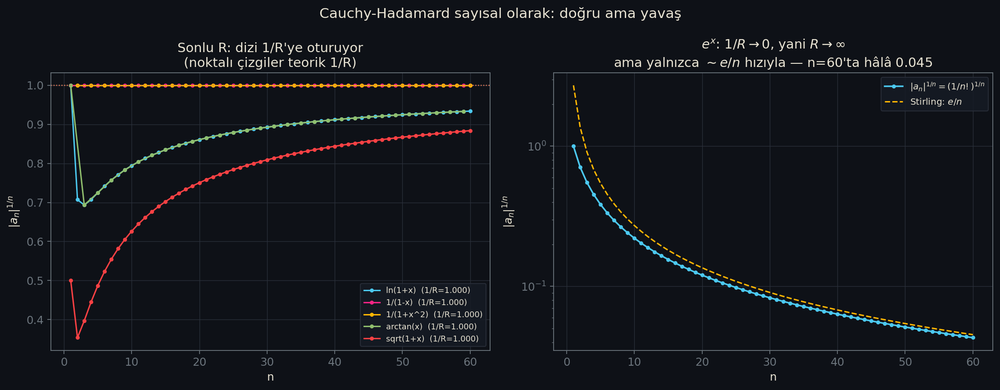

**Read:**

- `yakinsaklik_orani.py` → `kismi_kestirimler()`, `seyreklik_tuzagi()` (sparsity trap).
- `taylor.py` → `cauchy_hadamard_R()` (`son_k=12`, skips zeros) and
  `oran_testi_R()` (degree gap `d`).
- `04-lean/TaylorLab/Yaricap.lean` → `cauchy_hadamard`.
- In depth: [[10-seven-results#4. The same radius, from coefficients alone]].

**Ask yourself:**

1. C-H gives 19.11 for `exp`. Does that contradict $R=\infty$?
2. For `1/(1+x²)`, $a=1$, why does the ratio test have no limit?
3. An older version of the repo said the ratio test was off by 22.66 % in this row. Why was that number wrong?
4. Why does Mathlib write $\liminf 1/|a_n|^{1/n}$ instead of $\limsup |a_n|^{1/n}$?

---

## Session 7 — Converging is not being equal

**Time:** 45 min

**Goal:** grasp the difference between $C^\infty$ and $C^\omega$ through $e^{-1/x^2}$.

**Run:**

```powershell
python 02-python\src\analitik_degil.py
```

**Look at:**

- `out/tablolar/analitik_degil.md`: two tables. Derivatives ($n=0..8$, the
  limit and the value at $x=0.1$), and "real axis / imaginary axis".
- `out/gorseller/analitik_degil.png`.

  

- Video 5 (47 s):

  [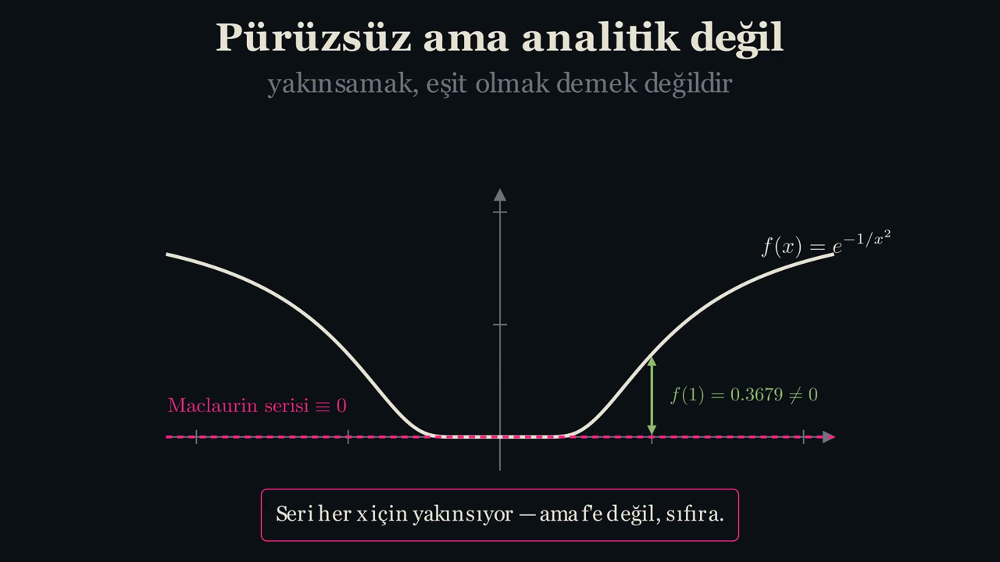](../../../out/videolar/5-AnalitikDegilSahnesi.mp4)
  ![[5-AnalitikDegilSahnesi.mp4]]

  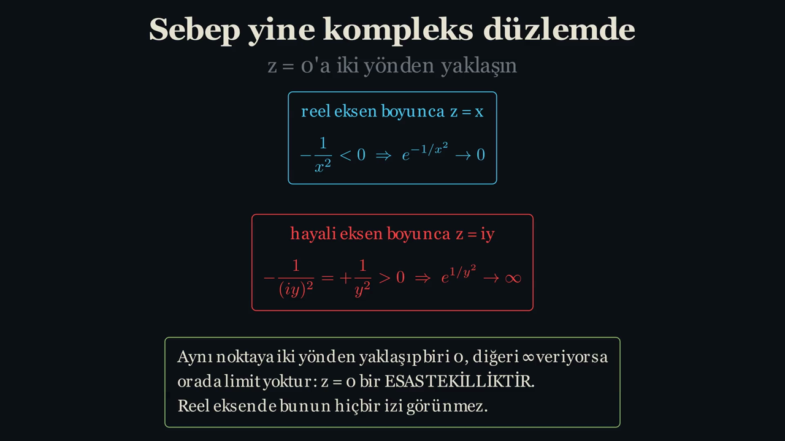

**Read:**

- `analitik_degil.py` → `turevler_sifirda()` (`sp.limit`), `kompleks_tekillik()`.
- `out/taylor-teori.pdf` §4 (proof skeleton: $f^{(n)}(x)=p_n(1/x)e^{-1/x^2}$).
- `04-lean/TaylorLab/AnalitikDegil.lean`.
- Atomic note: [[Pürüzsüz olmak analitik olmak değildir]].

**Ask yourself:**

1. Why are the derivatives computed with `sympy.limit` instead of finite differences?
2. The series has radius $\infty$, yet $z=0$ is an essential singularity.
   Does that contradict "R = distance to the nearest singularity"?
3. Lean's witness is $e^{-1/x}$, the script's is $e^{-1/x^2}$. Does it matter?

---

## Session 8 — The dropped term returns in the period

**Time:** 90 min

**Goal:** see why every stable equilibrium is harmonic, and how the dropped
$-\theta^3/6$ is measured as the amplitude dependence of the period.

**Run:**

```powershell
python 02-python\src\sarkac.py
godot --path 05-godot res://denge_oyunu.tscn
godot --headless --path 05-godot --script res://test_dogrulama.gd
```

**Look at:**

1. Video 6 (55 s): first the parabola settling onto the true potential...

   [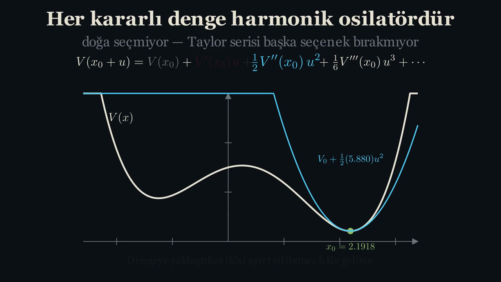](../../../out/videolar/6-DengeSahnesi.mp4)
   ![[6-DengeSahnesi.mp4]]

   ...then the two curves separating at amplitude 0.7. The true curve is
   asymmetric, and its period is longer than the harmonic ghost's:

   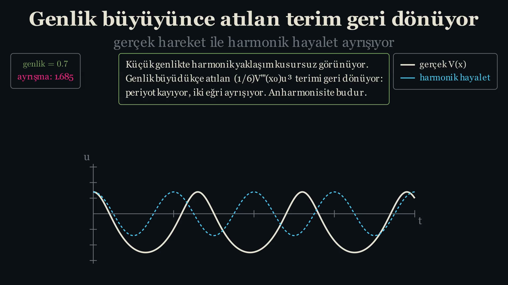

2. `out/tablolar/sarkac.md`: **ölçülen T** (measured), **eliptik T**
   (elliptic), **ölçüm-kapalı fark** (measured vs closed form), **Taylor-2
   hatası**, **Taylor-4 hatası** (errors).
3. `out/gorseller/sarkac_periyot.png`: the log–log slopes in the right panel title.

   

4. Web → **3 · Sarkaç** (pendulum), amplitude 150°:

   

5. Godot equilibrium game: set the amplitude to 10°, 45°, 90°, 150° and note
   the **Dayanma süresi** (survival time).

   

**Read:**

- `sarkac.py` → `periyodu_olc()` (measure period), `tam_periyot_eliptik()`, `taylor_periyot()`.
- `05-godot/denge_oyunu.gd` → `ellipK()` (AGM), `_rk4()`, `ESIK_DERECE` (threshold in degrees).
- `01-manim/scenes/s06_denge.py` → `V()`, `denge_bul()` (find equilibrium), `genlikler` (amplitudes).
- Atomic note: [[Her kararlı denge harmonik osilatördür]].

**Ask yourself:**

1. "At 150° the prediction is 76 % wrong." 76 % relative to what?
2. Why do the log–log slopes go 2, 4, 6, in steps of two?
3. An older version of video 6 used 1.3 as its last amplitude. Was the separation there "anharmonicity"?
4. Why does `periyodu_olc` take $T = 4\,t_{\text{first crossing}}$?

---

## Session 9 — Quantization is born from truncation

**Time:** 60 min

**Goal:** see that integers come not from the equation but from the
requirement that the series stays finite.

**Run:**

```powershell
python 02-python\src\frobenius.py
```

**Look at:**

- `out/tablolar/frobenius.md`: the Legendre table (**kısmi toplam
  büyümesi**, growth of partial sums), the Hermite table (**H(4)**, **ψ(4)**,
  **durum** = status), and the symbolic check (**denklemdeki kalıntı**,
  residual in the equation).
- `out/gorseller/frobenius_hermite.png` and `frobenius_legendre.png`.

  

**Read:**

- `frobenius.py` → `legendre_katsayilari()`, `hermite_katsayilari()`,
  `kesilme_derecesi()` (truncation degree), `kesilme_dogrula()`,
  `sembolik_dogrulama.kesin_katsayilar()`.

  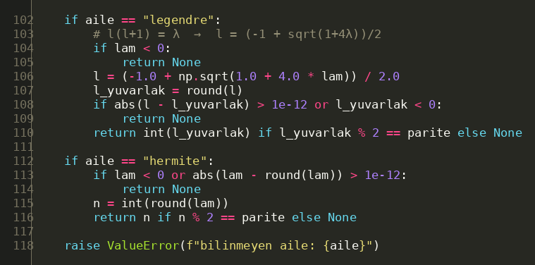

- `out/taylor-teori.pdf` §6.

**Ask yourself:**

1. With $\lambda=2$, does the **odd** series ($a_0=0,\ a_1=1$) terminate?
2. Why can't termination be decided by "did the coefficient drop below $10^{-14}$"?
3. What is the "normalize edilebilir / PATLIYOR" (normalizable / blows up) decision based on?
4. Where is the $n$ of $E_n=\hbar\omega(n+\tfrac12)$ in this script?

---

## Session 10 — The formal layer

**Time:** 90 min (not counting first-time setup; the Mathlib download can take longer)

**Goal:** read the Lean/Mathlib counterparts of three numerical findings and
learn how to check that a proof is "sorry-free".

**Run (Windows):**

```powershell
cd 04-lean
lake build
$p = Join-Path $env:TEMP 'axioms.lean'
[IO.File]::WriteAllText($p, @'
import TaylorLab
#print axioms TaylorLab.ksi_vardir
#print axioms TaylorLab.purussuz_ama_analitik_degil
#print axioms TaylorLab.cauchy_hadamard
theorem test : (1 : Nat) = 2 := by sorry
#print axioms test
'@)
lake env lean $p
cd ..
```

**Linux:** write the same content to `/tmp/axioms.lean`, then
`cd 04-lean && lake env lean /tmp/axioms.lean`.

**Look at:** the real theorems print
`depends on axioms: [propext, Classical.choice, Quot.sound]`; `test` prints
`warning: declaration uses 'sorry'` and `depends on axioms: [sorryAx]`.

**Read:**

- `04-lean/TaylorLab/Kalan.lean` → `ksi_vardir` ("ξ exists").

  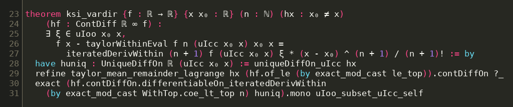

- `04-lean/TaylorLab/AnalitikDegil.lean` → `purussuz_ama_analitik_degil`
  ("smooth but not analytic"), `contDiff_setminus_analytic_nonempty`, `tanik_pozitif`.
- `04-lean/TaylorLab/Yaricap.lean` → `cauchy_hadamard`,
  `disk_icinde_mutlak_yakinsar`, `geometrik_yaricap_bir`.
- `LEAN-DURUM.md` (all of it) and [[07-layer-lean]].

**Ask yourself:**

1. Why does `ksi_vardir` use `uIoo x₀ x` rather than `Ioo`?
2. Why is `#print axioms` stronger evidence than a successful `lake build`?
3. Which of the seven results are **entirely** absent from Lean?
4. `geometrik_yaricap_bir` corresponds to which row of `cauchy_hadamard.md`?

---

## Answers

> [!warning] Answer them yourself first.

### Session 1

1. The series of $\sin$ converges for every $x$, but only **in the limit**.
   For fixed $N$, $P_N$ is a polynomial and goes to $\pm\infty$ as
   $|x|\to\infty$, while $\sin$ is bounded. The error is of order
   $|x|^{N+1}/(N+1)!$, so the good region is roughly
   $|x| \lesssim ((N+1)!\cdot\text{tol})^{1/(N+1)}$, which grows with $N$.
2. No. On the real line the function is bounded and infinitely
   differentiable. The cause is the poles at $z=\pm i$ (session 4).
3. Differentiating $(x-a)^n$ $n$ times leaves a factor $n!$; requiring
   $P^{(n)}(a)=f^{(n)}(a)$, dividing by $n!$ is the only way to undo it.
4. A measured number: `iyi_bolge()` returns the first $x$ (to the right of 0,
   on a 4000-point grid) where $|\sin x - P_N(x)|$ exceeds **0.05**.

### Session 2

1. To make the origin of each coefficient visible in code: take the $n$-th
   derivative, substitute $x=a$, divide by $n!$. It is a literal translation
   of the definition.
2. As $x$ moves away from $a$, the interval $[a,x]$ only **grows**, so
   $\sup_{[a,x]}|f^{(N+1)}|$ cannot decrease. A cumulative maximum outward
   from $a$ on a single grid suffices; the left and right branches are
   handled separately. It is checked against `lagrange_sinir_yavas`
   (kalan_dogrulama.py §2).
3. Not a bug, it is **the method's limit.** You cannot read infinity from
   finite data. Since $(1/n!)^{1/n}\approx e/n$, the estimate grows with $N$:
   7.93 at $N=30$, 19.11 at $N=60$, 41.3 at $N=120$. The ratio test returns
   exactly $N$ ($|a_n/a_{n+1}|=n+1$). "It keeps growing" is the only honest
   way to see $R=\infty$.
4. `aday_sayisi`: number of points where float64 says `true error > bound`
   (unconfirmed). `yuvarlama_sayisi`: number of points where the bound lies
   **below** the smallest difference float64 can measure
   (`(N+2)·eps·(Σ|term|+|f|)`).

### Session 3

1. No. That ratio was measured in float64. The point is $x\approx0.0126$ and
   the bound is $\approx7.9\times10^{-17}$, i.e. machine-epsilon territory.
   The "meaningful regime" classification relies on an estimated `(N+2)·eps`
   constant, so this point sat just above the floor and was counted as
   meaningful. Its mpmath ratio is **0.989**. In 6 of the 8 rows the "worst
   ratio" exceeds 1; all are the same kind of measurement artefact, and
   **all** 2224 candidates drop below 1 under mpmath.
   See [[10-seven-results#1. The Lagrange bound was never violated]].
2. The bound is a **product**, $\sup|f^{(N+1)}|\cdot|x-a|^{N+1}/(N+1)!$, with
   no cancellation. The error is the **difference** of two nearly equal
   numbers ($f(x)-P_N(x)$), and float64 cannot see past 16 digits.
3. Lagrange's theorem only needs $f$ to be differentiable enough on $[a,x]$.
   $\ln(1+x)$ is smooth on $[0,\,1.8]$. The radius of convergence is about
   the $N\to\infty$ limit and does not affect the finite-$N$ equality.
   Polynomial ≠ series.
4. No, it need not be unique. The theorem only asserts **existence**.
   `ksi_bul` scans $(a,x)$ at 4001 points and returns the root at the
   **first** sign change via `brentq`; other roots may exist.

### Session 4

1. $R=\min(|a-i|,|a+i|)$. With $\operatorname{Im}(a)>0$ the centre moves
   towards $+i$ and $R$ shrinks. The disk always touches the nearer singularity.
2. $1+z^2=(z-i)(z+i)$; the poles $\pm i$ are both at distance 1 from 0.
3. At finite $N$, the factor $C$ in $|f-P_N|\approx C\,(r/R)^{N+1}$ grows
   near the singularity and pulls the zero level inwards. The read radius is
   the **shortest** distance of that level from the centre, so it is always
   measured towards the singularity and always comes out a little small
   (session 5, question 2).
4. $e^z$ has no singularity ($R=\infty$). Everywhere in the window the error
   goes to zero with $N$, so there is no sign change.

### Session 5

1. The tail behaves like $|f-P_N|\sim C(|z-a|/R)^{N+1}$. Taking logs and
   dividing by $N$:
   $\frac{N+1}{N}\log_{10}(|z-a|/R)+\frac{\log_{10}C}{N}\to\log_{10}(|z-a|/R)$.
   Its sign tells convergence; its zero level is the circle $|z-a|=R$.
2. $f-P_N = z^{N+1}/(1-z)$. Along $z=r$ (towards the singularity) the zero
   level is the root of $r^{29}=1-r$, i.e. $r\approx0.9175$. With grid step
   $4.4/600\approx0.007$, the first positive pixel is at 0.9219. In the
   opposite direction $|1-z|=1+r$ and the zero level lies **outside** 1,
   which is why the shortest distance is towards the singularity.
3. Both are right but they measure slightly different things. Python uses a
   2.2 window, 600 pixels and "nearest pixel with `L>0`"; Octave uses a
   3 window, 600 pixels and **sign-changing neighbour pairs**. The gap comes
   from the grid. Both lie below the theoretical value (question 2).
4. It does not help, it hurts. The error goes from $3.5$ to
   $1.3\times10^{11}$, because for $|x|>R$ the terms grow like $(1.5)^n$.

### Session 6

1. No. $R=\infty$ cannot be read from finite $N$; the estimate grows with
   $N$ (session 2, question 3). The error column for this row is
   deliberately "—".
2. From $a=1$, $i$ and $-i$ are **equally far** ($\sqrt2$) but in different
   directions. The coefficients are
   $c_n=(-1)^n\,2^{-(n+1)/2}\sin\frac{(n+1)\pi}{4}$. The $\sin$ factor is
   periodic and vanishes for $n\equiv3 \pmod 4$, so successive ratios cycle
   through $\{1,\ 2,\ 2,\ \sqrt2\}$ and **have no limit**, while
   $\limsup|c_n|^{1/n}=1/\sqrt2$ exists.
3. The old `katsayi_dizisi` passed the centre as a float, and precision was
   lost in the high-order derivatives. At $n=40$ the relative error was
   $\sim10^{-5}$; at $n=60$ even the **sign** of the coefficient was wrong.
   The 22.66 % (and 1.66 % for C-H) were artefacts of that loss. The centre is
   now passed as `sp.Rational(a)`, and at $N=60$ the ratio test gives exactly
   $\sqrt2$ and C-H gives 1.4228 (0.61 %). What shows "no limit" is the ratio
   **oscillating** with $N$, not a single $N$. See [[12-gaps-and-next-steps]].
4. They are equivalent: $\limsup x_n = 1/\liminf(1/x_n)$ (for positive
   sequences, values in $[0,\infty]$). Mathlib picks this form to express
   the radius directly in $\mathbb{R}_{\ge0}^\infty$ (`p.radius_eq_liminf`).

### Session 7

1. $f(0.1)=e^{-100}\approx3.7\times10^{-44}$. A float64 difference quotient
   cannot tell that from zero, so "it came out zero" proves nothing.
   `sympy.limit` takes the limit algebraically.
2. No contradiction. That theorem requires $f$ to be **holomorphic** on a
   disk around the centre. $e^{-1/z^2}$ is not holomorphic at $z=0$, so the
   theorem does not apply. The "series" here is not the series of a
   holomorphic function, just a formal series built from real derivatives,
   and it is identically 0.
3. Conceptually no: both witness $C^\omega\subsetneq C^\infty$. Formally,
   Lean does not prove the statement for the script's **exact** function;
   `LEAN-DURUM.md` says so explicitly.

### Session 8

1. Relative to the **harmonic prediction**:
   $(3.535702-2.006409)/2.006409=76.2\,\%$. Relative to the true period, the
   error is $(3.535702-2.006409)/3.535702=43.3\,\%$. The table's "Taylor-2
   hatası" column is relative to the **elliptic** value (18.94 % at 150°).
2. $T(\theta_0)$ is even ($\theta_0\to-\theta_0$ symmetry), so the series has
   only even powers. Adding the $\theta_0^2$ term lowers the error from
   $\theta_0^2$ to $\theta_0^4$; the next one lowers it to $\theta_0^6$.
   Measured: 4.00 and 6.01.
3. **No.** The scene's potential has $x_0\approx2.1918$; the other critical
   points are $-1.248$ (local minimum) and $0.249$ (the barrier top,
   $V\approx3.077$). At amplitude 1.3 the energy is $V(x_0+1.3)\approx9.49$,
   above the top. The particle leaves the well and $u$ goes down to about
   $-4.75$. The plot is clipped at $\pm1.6$, hence the flat plateaus. This is
   not a small anharmonic correction but **barrier crossing**. The threshold
   amplitude is $\approx0.784$, which is why the scene now uses
   0.25 / 0.5 / 0.7; at 0.7 ($E\approx2.46<3.08$) the particle stays in the
   well. See [[04-layer-manim]].
4. The pendulum is released from $\theta_0$ at rest; the first time it
   reaches $\theta=0$ is a quarter period. The `events` mechanism locates
   that moment by root-finding inside the step, which is more precise than
   reading a grid.

### Session 9

1. No. Hermite termination needs $\lambda$ to be an integer **and** the
   parity to match ($\lambda=2$ is even). The odd series runs over
   $n=1,3,5,\dots$ with $a_{n+2}\propto(n-2)a_n$, and $n-2$ is never zero.
   `kesilme_derecesi(2, "hermite", 1)` → `None`.
2. Series that do not terminate can still have rapidly shrinking
   coefficients. For $\lambda=2.5$ they shrink like those of $e^{x^2}$ and drop
   below $10^{-14}$ after $n\approx28$, yet they are not zero and the function
   blows up. The decision is read from the recurrence **numerator** vanishing
   algebraically.
3. On the normalization integral: $\int\psi^2dx$ is computed over $[-4,4]$
   and then over $[-6,6]$; if the ratio is $<1.01$, the state is
   "normalizable". For integer $\lambda$ the ratio is $1.000000$–$1.000085$;
   for $\lambda=2.5$ and $3.7$ it is $9.5\times10^6$ and $1.0\times10^6$. (The
   old version only looked at $|\psi(4)|<1$.)
4. For Hermite, `kesilme_derecesi` returns $n=\lambda$: the index where the
   recurrence numerator $2(n-\lambda)$ vanishes. The equation
   $y''-2xy'+2\lambda y=0$ corresponds, for the quantum harmonic oscillator,
   to $E=\hbar\omega(\lambda+\tfrac12)$.

### Session 10

1. $x$ may be smaller than $x_0$. `uIoo x₀ x` is the open interval
   regardless of endpoint order; the script's `exp(x), x=-1.5` row is exactly
   that case.
2. `lake build` only says "type checking passed"; a proof closed with
   `sorry` also builds (with just a warning). `#print axioms` lists the axioms
   a proof depends on. If `sorryAx` is absent, no proof is left open.
3. Pendulum / harmonic oscillator (result 5), Frobenius / quantization
   (result 6), and the geometric half of result 3 ("R = distance to the
   nearest singularity"). Also, for result 7 the witness is $e^{-1/x}$, not
   $e^{-1/x^2}$.
4. The `1/(1-x)`, $a=0$ row: C-H 1.0000, error 0.00 %.
