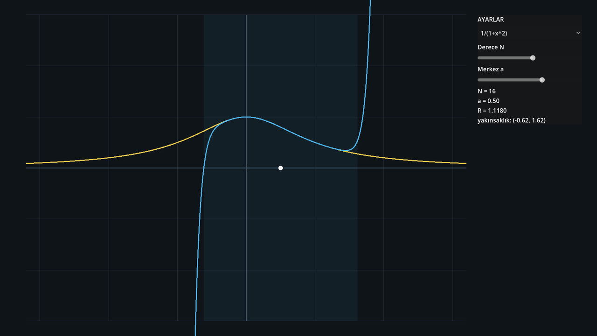
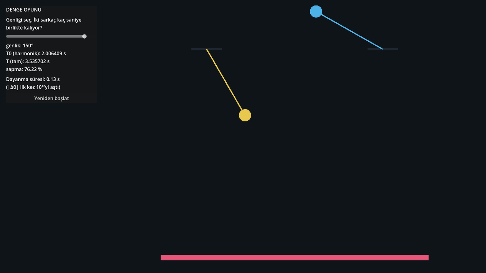

# Layer: Godot 4 (`05-godot/`)

↑ [[00-START-HERE]] · Plan: session 8 · Türkçe: [[08-katman-godot]]

## What question does it answer?

"What happens when I change the parameter **by hand**?" It is also the third
independent implementation: coefficients from closed forms in GDScript,
pendulum period via AGM, compared against Python's numbers. UI text is Turkish.

## File by file

| File | What it does |
|---|---|
| `project.godot` | Godot 4.7, GL Compatibility, 1600×900, main scene `taylor_explorer.tscn` |
| `taylor_explorer.tscn` + `.gd` | **Scene 1, Taylor explorer.** Function choice (`1/(1+x^2)`, `1/(1-x)`, `ln(1+x)`, `sin`, `exp`), degree $N\in[0,30]$, centre $a\in[-2,2]$. The side panel shows $N$, $a$, $R$ and the interval of convergence, which is drawn as a blue band. Functions: `f()`, `katsayilar()` (coefficients), `yaricap()` (radius), `polinom()` (Horner). |
| `denge_oyunu.tscn` + `.gd` | **Scene 2, equilibrium game.** Full equation on the left, harmonic on the right, both integrated with RK4 ($h=0.002$) from the same amplitude. **Dayanma süresi** (survival time) = the moment $\lvert\Delta\theta\rvert$ first exceeds `ESIK_DERECE = 10°`. The bar at the bottom turns red when the threshold is crossed. `ellipK()` (AGM, 60 steps), `tam_periyot()` (full period). |
| `test_dogrulama.gd` | **30 checks** without a window: 16 coefficients, 5 convergence checks ($a=0.3$, $N=40$), 4 radii, 5 pendulum periods. |
| `icon.svg`, `.gitignore` | Icon; the `.godot/` cache is git-ignored |





## How to run

```powershell
godot --path 05-godot                            # Taylor explorer
godot --path 05-godot res://denge_oyunu.tscn     # equilibrium game
godot --headless --path 05-godot --script res://test_dogrulama.gd
```

(Same commands on Linux.) Both scenes opened in a window on Windows and the
test printed "SONUC: 0 hata" (0 errors).

## Where is the output?

No files. On first launch Godot creates the `05-godot/.godot/` cache
(git-ignored).

## Prerequisites

- GDScript: `extends Node2D`, `_ready`, `_process`, `_draw`, `queue_redraw`,
  signals (`value_changed.connect`), `match`.
- RK4 integration; the complete elliptic integral of the first kind $K(m)$
  and the arithmetic-geometric mean: $K(m)=\dfrac{\pi}{2\,\mathrm{AGM}(1,\sqrt{1-m})}$.
- Pendulum: $T=4\sqrt{L/g}\,K(\sin^2(\theta_0/2))$.

## Observations

- The explorer scene has **no axis number labels**; grid lines are at
  integers ($x,y\in[-3,3]$).
- The catalogue has no `cos` or `sqrt(1+x)` (the web and Octave layers do).
- In the equilibrium game at 150°, the survival time is about **0.13 s**: the
  pendulums separate almost immediately.
- The comment in `project.godot` refers to `testler/test_kendini.gd` and says
  the constants are "identical" to `s06_denge.py`. The actual file is
  `test_dogrulama.gd`, and the equilibrium game uses the pendulum, not the
  polynomial potential of `s06_denge.py`. See [[12-gaps-and-next-steps]].
- In `taylor_explorer.gd`, the first comment line of the `1/(1+x^2)` block
  still quotes the old (wrong) `-Im(...)` formula; the code and the comment
  below use the fixed version (`RAPOR.md` §3.5).

## Things to tinker with

1. **Survival table.** Set the amplitude to 10°, 15°, 20°, 30°, 45° and write
   down the survival times. Plot $\log(\text{time})$ against $\log\theta_0$.
   Rough expectation: $\lvert\Delta\theta\rvert\approx\theta_0\,\Delta\omega\,t$
   with $\Delta\omega/\omega\approx\theta_0^2/16$, so time $\propto\theta_0^{-3}$
   (slope $\approx-3$). Does the measurement agree? Also try 5°: the two
   angles can differ by at most $2\theta_0=10°$, while the threshold is
   "**greater** than 10°". Compare with the code comment claiming it "takes
   minutes at 5°".
2. **Change the threshold.** In `denge_oyunu.gd` set `const ESIK_DERECE := 10.0`
   to `1.0`. How much shorter does the survival time get at 5°?
3. **Add a missing function.** Add `"cos"` to `KATALOG` in
   `taylor_explorer.gd`; extend `f()` and `katsayilar()` (cycle:
   `[cos(a), -sin(a), -cos(a), sin(a)]`), and add a `cos c_2 = -0.5` check to
   `test_dogrulama.gd`. Run the test.

## Related

[[09-layer-web]] (the same two ideas in a browser) · [[03-layer-python]] (reference numbers)
