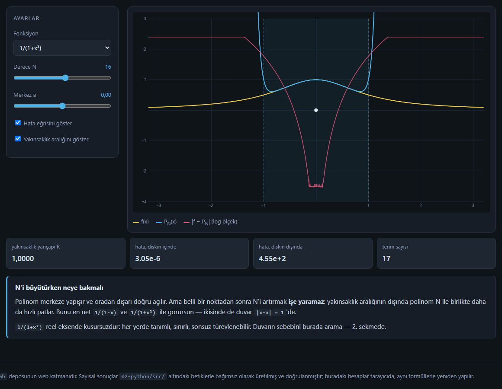
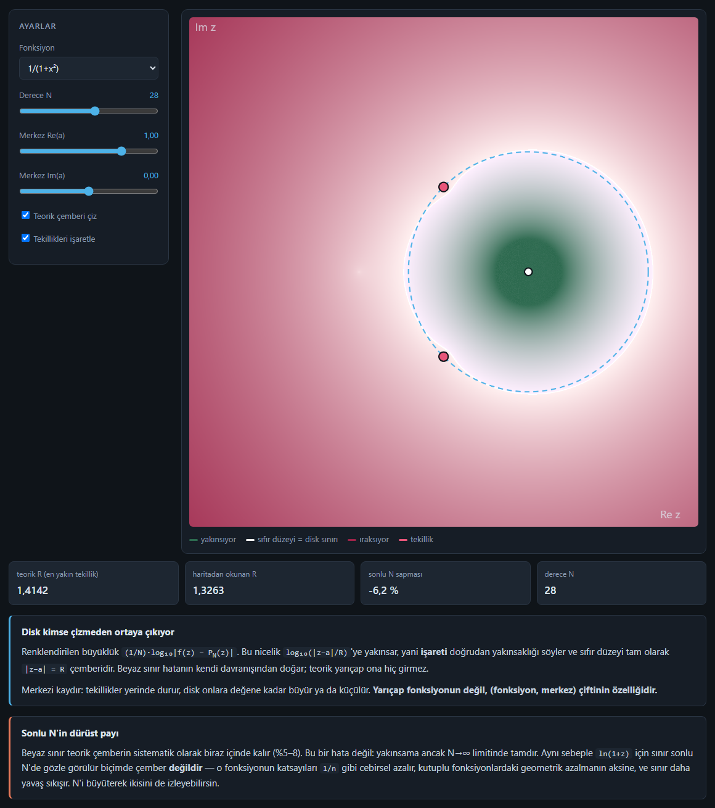
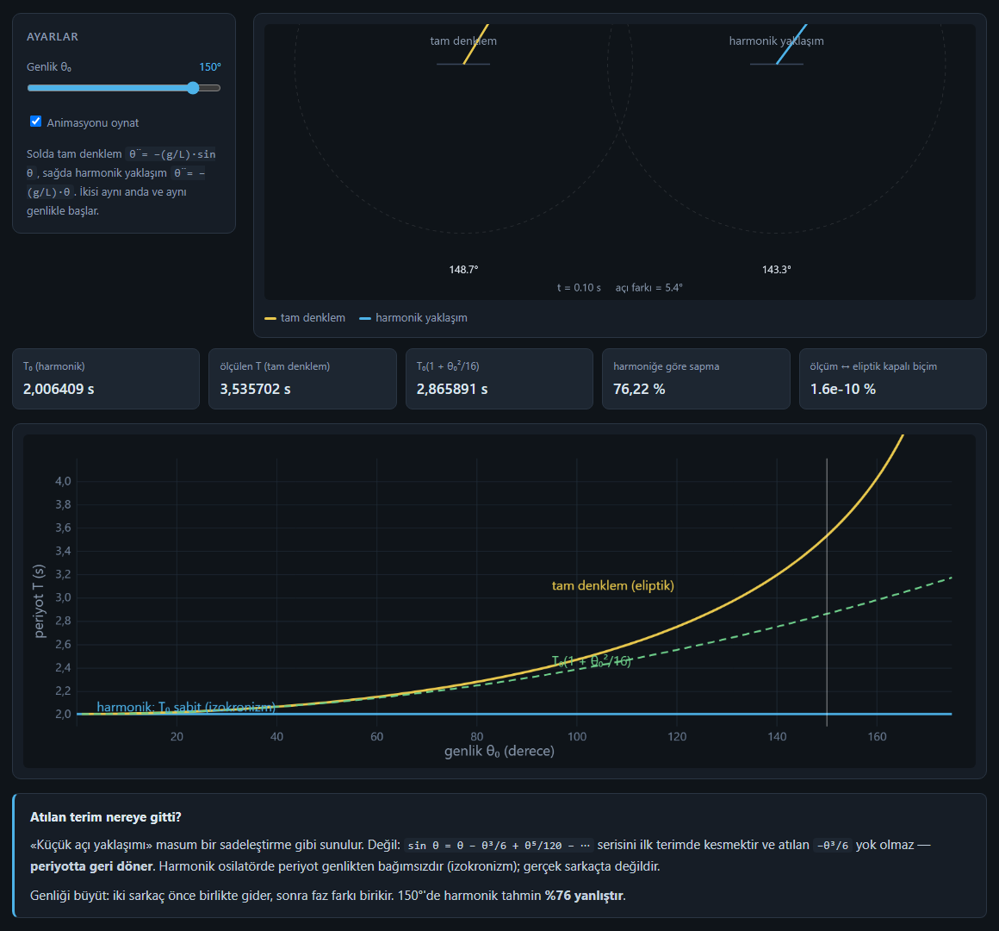

# Layer: Web (`06-web/`)

↑ [[00-START-HERE]] · Plan: sessions 1, 4, 8 · Türkçe: [[09-katman-web]]

## What question does it answer?

"Can I see and tweak this in a browser, with no install?" It is also the
fourth independent implementation: its own complex arithmetic in JavaScript
(the `C` object), closed-form coefficients, RK4 and AGM. The UI is in Turkish.

## File by file

| File | What it does |
|---|---|
| `index.html` | Single file (~860 lines), no external resources. Three tabs, four `<canvas>` elements. Script sections: complex arithmetic `C`, `KATALOG` (7 functions with closed-form `kats(a, N)` and `R(a)`), `polinom()` (Horner), tab switcher, panel 1 (`yCiz`), panel 2 (`kCiz`), panel 3 (`rk4`, `periyotOlc`, `ellipK`, `sCiz`, `sGrafikCiz`, `sAdim`). |
| `test_matematik.mjs` | Reads `index.html` **itself**, cuts out the DOM-free maths core and runs 34 checks: function values, coefficients, convergence at $N=40$, centre shifts, a **complex centre** ($a=0.4+0.3i$, $N=45$), pendulum periods. |

### The three panels

| Tab | Controls | Cards |
|---|---|---|
| **1 · Yaklaşım ve hata** (approximation and error) | function, $N\in[0,30]$, $a\in[-2,2]$, error curve, interval of convergence | radius R, error inside / outside the disk, number of terms |
| **2 · Kompleks disk** (complex disk) | function, $N\in[4,48]$, $\operatorname{Re}a\in[-2,2]$, $\operatorname{Im}a\in[-1.5,1.5]$, theoretical circle, singularities | theoretical R, R read from the map, finite-N deviation, degree N |
| **3 · Sarkaç** (pendulum) | amplitude $\theta_0\in[5°,170°]$, animation | $T_0$, measured T, $T_0(1+\theta_0^2/16)$, deviation from harmonic, measured ↔ elliptic |







## How to run

```powershell
python -m http.server 8765
# http://localhost:8765/06-web/index.html
node 06-web\test_matematik.mjs       # SONUC: 0 hata / 34 kontrol
```

## Where is the output?

In the browser. No files.

## Prerequisites

- Canvas 2D API, `ImageData` / `Float32Array`.
- Complex numbers stored as `[re, im]` pairs; branch cuts of complex `log`
  and `sqrt` (the ray $z\le-1$ for `ln(1+z)` and `√(1+z)`).
- ES modules: `test_matematik.mjs` imports the core as a `data:` URL.

## Cross-layer comparison

| Measurement | Python | Octave | Web | Godot |
|---|---|---|---|---|
| read $R$, `1/(1+z²)`, $a=0$ | 0.9366 | 0.9266 | 0.9333 (`ENVANTER.md`) | — |
| read $R$, `1/(1+z²)`, $a=1$ | 1.3321 | 1.3233 | 1.3263 | — |
| $T(150°)$ | 3.535702 | — | 3.535701938 | 3.5357019383 |

## Observations

- Tested only in Chrome (desktop and headless). Firefox and Safari were not tested.
- In panel 3, at large amplitudes (≈150°) the bob leaves the top edge of the
  canvas; this is visible in the screenshot above.
- The page says "at 150° the harmonic prediction is **76 % wrong**"; that is
  the relative difference with respect to the harmonic value. See
  [[10-seven-results#5. The bill for the small-angle approximation]].

## Things to tinker with

1. **Complex centre.** In panel 2 set `Im(a)=0.5`, `Re(a)=0`. The theoretical
   R should be $\lvert 0.5i - i\rvert=0.5$. Which singularity does the disk touch now?
2. **Branch cut.** In panel 2 choose `√(1+x)` and raise $N$ to 48. How does
   the white boundary behave towards $z=-1$? Compare with `ln(1+x)`.
3. **Write a test.** Add
   `esit("cos a_2 = -1/2", M.KATALOG["cos(x)"].kats([0, 0], 2)[2][0], -0.5, 1e-15);`
   to `test_matematik.mjs` and run `node 06-web/test_matematik.mjs`. The check
   count should become 35.

## Related

[[08-layer-godot]] · [[04-layer-manim]] · [[03-layer-python]]
