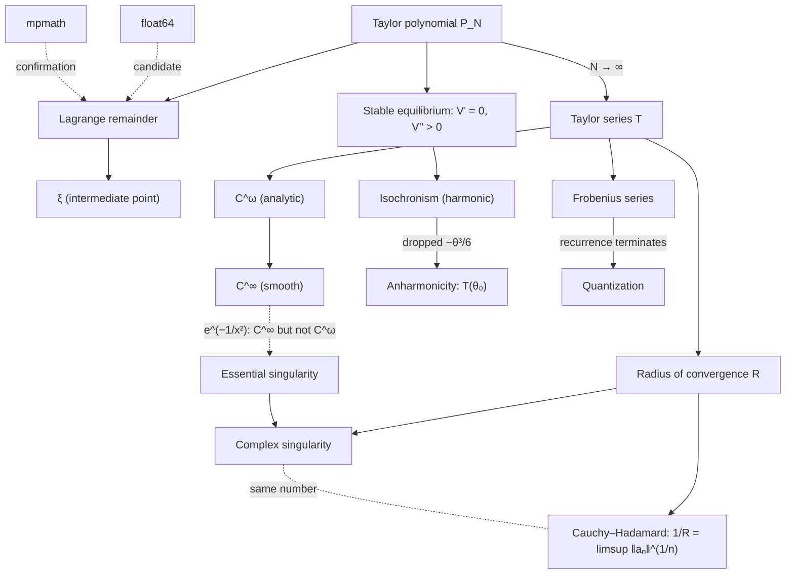

# Concept map

↑ [[00-START-HERE]] · Results: [[10-seven-results]] · Türkçe: [[11-kavram-haritasi]]

## Links (one sentence each)

| Link | Reason |
|---|---|
| Taylor polynomial ↔ Taylor series | The polynomial is finite and always exists; the series is its $N\to\infty$ limit and may fail to exist or converge to the wrong function. |
| Taylor polynomial ↔ Lagrange remainder | The remainder is the term that gives the polynomial's error **exactly**; it is an equality, not a bound. |
| Lagrange remainder ↔ ξ | The equality evaluates $f^{(N+1)}$ at some $\xi$ between $a$ and $x$, which comes from applying the mean value theorem (Rolle) $N+1$ times. |
| ξ ↔ radius of convergence | They are unrelated: $\xi$ exists for every fixed $N$, while the radius only concerns the limit $N\to\infty$ (`ln(1+x)`, $x=1.8$). |
| Radius of convergence ↔ complex singularity | A power series converges on a disk in the complex plane, and the disk stops where it first touches a singularity. |
| Complex singularity ↔ Cauchy–Hadamard | The distance to the singularity sets the exponential growth rate of the coefficients, so geometry and $\limsup\lvert a_n\rvert^{1/n}$ give the same $R$. |
| Cauchy–Hadamard ↔ ratio test | The ratio test works only if $\lvert a_n/a_{n+1}\rvert$ has a limit; with several equidistant singularities there is no limit, but the $\limsup$ still exists. |
| $C^\infty$ ↔ $C^\omega$ | Being analytic means being infinitely differentiable **and** equal to one's Taylor series; $e^{-1/x^2}$ fails the second condition. |
| $C^\omega$ ↔ essential singularity | The essential singularity of $e^{-1/z^2}$ at $z=0$ destroys analyticity right at the centre, even though it is invisible on the real line. |
| Stable equilibrium ↔ isochronism | $V'(x_0)=0$ kills the first-order term, the first surviving (quadratic) term gives a harmonic oscillator, and a harmonic oscillator's period does not depend on amplitude. |
| Isochronism ↔ anharmonicity | The dropped cubic term ($-\theta^3/6$ for $\sin$) makes the period amplitude-dependent: $T=T_0(1+\theta_0^2/16+\dots)$. |
| Anharmonicity ↔ radius of convergence | The series for $T(\theta_0)$ is itself a power series, with a singularity at $\theta_0=\pi$ (the pendulum balanced upright, $T\to\infty$). Not measured in the repo; see [[12-gaps-and-next-steps]]. |
| Frobenius ↔ quantization | The recurrence gives a series for every $\lambda$; the series terminates only when the numerator vanishes (integer $\lambda$), and only a terminating series gives a finite (normalizable) solution. |
| Frobenius ↔ Taylor series | The direction is reversed: Taylor gets a series from a function; Frobenius gets a function from a series. |
| float64 ↔ mpmath | float64 can only flag candidates, because under catastrophic cancellation it cannot see below ~$10^{-16}$; high precision delivers the verdict. |
| Measurement ↔ proof | No number of trials proves a theorem; Lean + Mathlib checks the proof, and `#print axioms` shows there is no `sorry`. |

## Where each concept lives

| Concept | Guide | Atomic note (Turkish) |
|---|---|---|
| Why $n!$ is forced; polynomial ↔ series | [[10-seven-results#2. ξ really exists — even outside the radius]] | [[Taylor açılımı bir tanım değil zorunluluktur]] |
| Radius, singularity, limsup | [[10-seven-results#3. The disk of convergence came out of the data]] | [[Yakınsaklık yarıçapı kompleks düzlemde belirlenir]] |
| $C^\infty$ vs $C^\omega$ | [[10-seven-results#7. Smooth but not analytic]] | [[Pürüzsüz olmak analitik olmak değildir]] |
| Equilibrium, pendulum, quantization | [[10-seven-results#5. The bill for the small-angle approximation]] | [[Her kararlı denge harmonik osilatördür]] |

To start your own concept card: [[_templates/concept-card|concept card template]].
