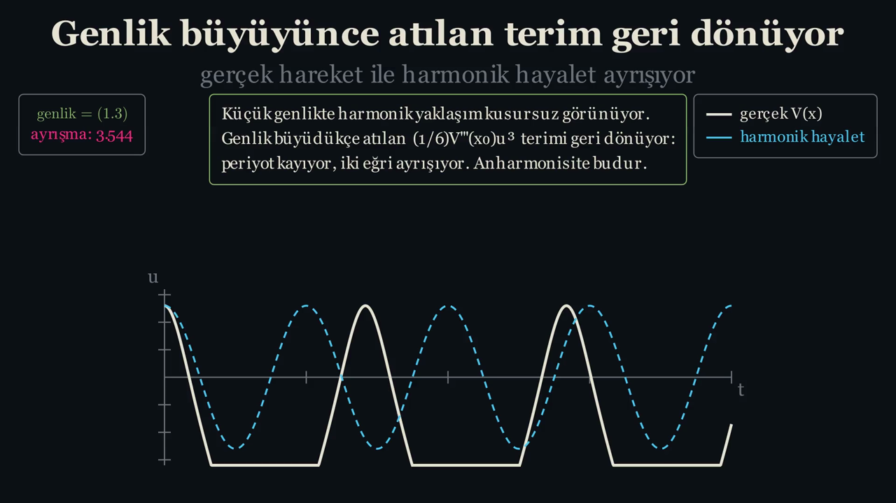

# Katman: Manim (`01-manim/`)

↑ [[00-BASLA-BURADAN]] · Plan: Oturum 1, 3, 4, 7, 8 · English: [[04-layer-manim]]

## Hangi soruyu cevaplıyor?

"Bu iddiayı **gözle** nasıl görürüm?" Sahnelerdeki sayılar elle yazılmaz,
aynı formüllerden anlık hesaplanır (ör. video 3'teki oran, video 6'daki
denge noktası). Renk paleti `tema.py`'de, `02-python/src/ortam.py` ile
birebir aynı.

## Dosya dosya ve videolar

Videolar `out/videolar/` altında: 1920×1080, 60 fps. Obsidian'da aşağıdaki
gömülü oynatıcılar ancak depo kökü kasa olarak açıldığında çalışır.
GitHub'da küçük resme tıklayınca video açılır.

| Sahne dosyası | Sınıf | Süre | Ne gösteriyor | Anahtar parametre |
|---|---|---|---|---|
| `scenes/s01_artan_derece.py` | `ArtanDereceSahnesi` | 25,3 sn | $\sin$ üzerine oturan $P_N$; "geçerli bölge" bandı büyüyor | `DERECELER = [1,3,…,15]`, `iyi_bolge(tolerans=0.05)` |
| `scenes/s02_turetme.py` | `TuretmeSahnesi` | 40,3 sn | $x=a$ koy / türev al → $c_n=f^{(n)}(a)/n!$ | — |
| `scenes/s03_kalan_terimi.py` | `KalanTerimiSahnesi` | 33,7 sn | log eksende gerçek hata ve sınır, $N=1..10$ | $\sin$ için $\sup\lvert f^{(N+1)}\rvert=1$; test noktası $x=2$, $N=10$ |
| `scenes/s04_kompleks_yaricap.py` | `KompleksYaricapSahnesi` | 57,9 sn | reel eksen → $\pm i$ kutupları → ısı haritası ($N=2,4,8,16,30$) → merkez $a=0{,}7;\,1{,}4;\,2{,}0$ | `PENCERE = 2.6`, `IZGARA = 420` |
| `scenes/s05_analitik_degil.py` | `AnalitikDegilSahnesi` | 47,1 sn | $f^{(n)}(0)=0$, seri $\equiv0$, $f(1)=0{,}3679$, iki yönden $z\to0$ | `f_guvenli()` |
| `scenes/s06_denge.py` | `DengeSahnesi` | 54,9 sn | keyfi $V(x)$, $x_0\approx2{,}1918$, $k=V''(x_0)\approx5{,}880$; genlik 0,25 / 0,7 / 1,3 | `V()`, `genlikler` |
| `scenes/tema.py` | — | — | renkler, yazı boyutları, `baslik()`, `eksen()`, `etiket_kutusu()` | — |
| `render.sh` | — | — | sahneleri render edip `out/videolar/<sıra>-<Sınıf>.mp4`'ye kopyalar | `KALITE` (varsayılan `-qh`) |

[](../../../out/videolar/1-ArtanDereceSahnesi.mp4)
![[1-ArtanDereceSahnesi.mp4]]

[](../../../out/videolar/2-TuretmeSahnesi.mp4)
![[2-TuretmeSahnesi.mp4]]

[](../../../out/videolar/3-KalanTerimiSahnesi.mp4)
![[3-KalanTerimiSahnesi.mp4]]

[](../../../out/videolar/4-KompleksYaricapSahnesi.mp4)
![[4-KompleksYaricapSahnesi.mp4]]

[](../../../out/videolar/5-AnalitikDegilSahnesi.mp4)
![[5-AnalitikDegilSahnesi.mp4]]

[](../../../out/videolar/6-DengeSahnesi.mp4)
![[6-DengeSahnesi.mp4]]

## Nasıl çalıştırılır

```powershell
cd 01-manim
manim -ql --disable_caching scenes\s04_kompleks_yaricap.py KompleksYaricapSahnesi   # önizleme
cd ..
```

```bash
(cd 01-manim && PATH="$PWD/../.venv313/bin:$PATH" manim -ql --disable_caching scenes/s04_kompleks_yaricap.py KompleksYaricapSahnesi)
PATH="$PWD/.venv313/bin:$PATH" bash 01-manim/render.sh 4     # 1080p60, out/videolar'ı ezer
```

## Çıktı nerede?

- `manim` doğrudan çağrılınca: `01-manim/media/videos/<dosya>/<çözünürlük>/<Sınıf>.mp4`
  (`-ql` → `480p15`). Bu klasör git'e girmez.
- `render.sh` ile: `out/videolar/`. Mevcut doğrulanmış videoların **üzerine yazar**.

## Ön bilgi

- Manim Community **0.19** API'si: `Scene.construct`, `self.play`,
  `Axes.plot`, `Transform` / `ReplacementTransform`, `MathTex`, `Text`.
- LaTeX kurulu olmalı (`MathTex` → dvisvgm).
- Sahne 4 için: numpy ile ızgarada hesap, `ImageMobject`.

## Eleştirel not: video 6'nın son bölümü



Kapanış metni "genlik büyüdükçe atılan $\tfrac16V'''(x_0)u^3$ terimi geri
dönüyor … anharmonisite budur" der. Genlik 0,7 için bu doğru; genlik 1,3 için
**değil**:

- Potansiyelin kritik noktaları $-1{,}248$ (sol minimum), $0{,}249$ (tepe,
  $V\approx3{,}077$), $2{,}192$ (sağ minimum).
- Genlik 1,3'te enerji $V(x_0+1{,}3)\approx9{,}49 > 3{,}077$. Parçacık tepeyi
  aşar, $u$ yaklaşık $-4{,}75$'e kadar iner.
- Grafik `np.clip(u, -1.6, 1.6)` ile kırpıldığı için bu kaçış **düz platolar**
  olarak görünür. Ekrandaki "ayrışma: 3.544" bir faz kaymasını değil, kuyudan
  çıkışı ölçer.
- Ayrıca kutudaki yazı `genlik = (1.3)` biçiminde parantezli çıkıyor
  (`formul(rf"\text{{genlik}}=({A})")`).

Hesap: `V`, `dV`, `ddV` ve `denge_bul` fonksiyonlarını `solve_ivp` ile
çalıştırarak yapıldı (bkz. [[02-calisma-plani#Oturum 8 — Atılan terim periyotta geri döner]]).

## Kurcalama önerileri

1. **Bariyer eşiğini bul.** Önce Python'da $V(x_0+A)=V_{\text{tepe}}$
   denklemini `brentq` ile çöz. Eşik $A\approx0{,}784$ çıkmalı; $A=1{,}0$ bile
   bariyeri aşar ($E\approx5{,}16$). Sonra `s06_denge.py` →
   `genlikler = [0.25, 0.7, 1.3]`'ü `[0.25, 0.5, 0.75]` yap ve `-ql` ile render
   et. Platolar kayboluyor mu? Ayrışma artık gerçekten bir faz kayması mı?
2. **Toleransla oyna.** `s01_artan_derece.py` → `iyi_bolge(N, tolerans=0.05)`
   yerine `tolerans=0.005` kullan. $N=15$'te bölge $6{,}1$'den kaça iner?
3. **Başka merkez.** `s04_kompleks_yaricap.py` → `for a_yeni in (0.7, 1.4, 2.0)`
   döngüsüne `-1.0` ekle. Ekrandaki $R=|a-i|$ değeri $\sqrt2$ olmalı. Disk
   hangi tarafa kayıyor?

## İlgili

- Aynı sahnelerin etkileşimli hâli: [[09-katman-web]], [[08-katman-godot]]
- Sahnelerin dayandığı sayılar: [[03-katman-python]]
