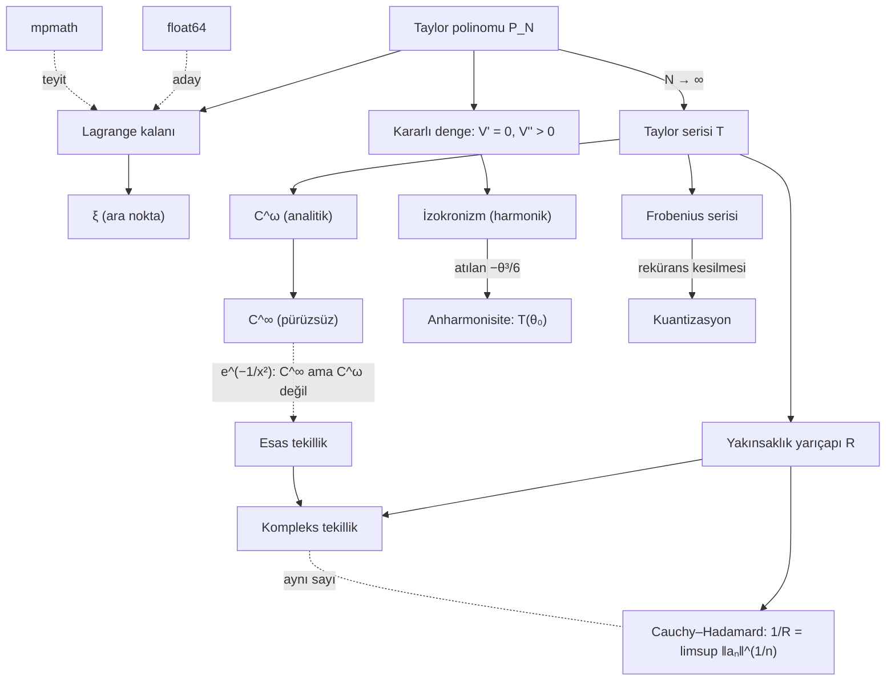

# Kavram haritası

↑ [[00-BASLA-BURADAN]] · Sonuçlar: [[10-yedi-sonuc]] · English: [[11-concept-map]]

## Bağlantılar (her biri tek cümle)

| Bağlantı | Gerekçe |
|---|---|
| Taylor polinomu ↔ Taylor serisi | Polinom sonlu ve her zaman vardır; seri onun $N\to\infty$ limitidir ve var olmayabilir ya da yanlış fonksiyona gidebilir. |
| Taylor polinomu ↔ Lagrange kalanı | Kalan, polinomun hatasını **tam** veren terimdir; sınır değil eşitliktir. |
| Lagrange kalanı ↔ ξ | Eşitlik, $f^{(N+1)}$'in $a$ ile $x$ arasındaki bir $\xi$'deki değeriyle kurulur; $\xi$ ortalama değer teoreminin (Rolle) $N+1$ kez uygulanmasından doğar. |
| ξ ↔ yakınsaklık yarıçapı | İlgisizdirler: $\xi$ her sabit $N$ için vardır, yarıçap ise yalnızca $N\to\infty$ limitini ilgilendirir (`ln(1+x)`, $x=1{,}8$). |
| Yakınsaklık yarıçapı ↔ kompleks tekillik | Kuvvet serisi kompleks düzlemde bir disk üzerinde yakınsar ve disk ilk tekilliğe değdiği yerde durur. |
| Kompleks tekillik ↔ Cauchy–Hadamard | Tekilliğin uzaklığı katsayıların üstel büyüme hızını belirler, o yüzden geometri ile $\limsup\lvert a_n\rvert^{1/n}$ aynı $R$'yi verir. |
| Cauchy–Hadamard ↔ oran testi | Oran testi yalnızca $\lvert a_n/a_{n+1}\rvert$'nin limiti varsa çalışır; eşit uzaklıkta birden çok tekillik varsa limit yoktur ama $\limsup$ vardır. |
| $C^\infty$ ↔ $C^\omega$ | Analitik olmak, sonsuz türevlenebilir olup **ayrıca** Taylor serisine eşit olmaktır; $e^{-1/x^2}$ ikinci şartı sağlamaz. |
| $C^\omega$ ↔ esas tekillik | $e^{-1/z^2}$'nin $z=0$'daki esas tekilliği, reel eksende görünmese de analitikliği tam merkezde bozar. |
| Kararlı denge ↔ izokronizm | $V'(x_0)=0$ birinci mertebe terimi öldürür, ilk hayatta kalan karesel terim harmonik osilatör verir ve harmonik osilatörün periyodu genlikten bağımsızdır. |
| İzokronizm ↔ anharmonisite | Atılan kübik ($\sin$ için $-\theta^3/6$) terim periyodu genliğe bağlar: $T=T_0(1+\theta_0^2/16+\dots)$. |
| Anharmonisite ↔ yakınsaklık yarıçapı | $T(\theta_0)$'ın serisi de bir kuvvet serisidir ve $\theta_0=\pi$'de (tepede duran sarkaç, $T\to\infty$) tekilliği vardır. Depoda ölçülmedi; bkz. [[12-eksikler-ve-devam]]. |
| Frobenius ↔ kuantizasyon | Rekürans her $\lambda$ için bir seri verir; seri yalnızca pay sıfırlanınca (tam sayı $\lambda$) kesilir ve ancak kesilen seri sonlu (normalize edilebilir) çözüm verir. |
| Frobenius ↔ Taylor serisi | Yön terstir: Taylor'da fonksiyondan seri çıkar, Frobenius'ta seriden fonksiyon doğar. |
| float64 ↔ mpmath | float64 yalnızca aday gösterir, çünkü yıkıcı sadeleşmede ~$10^{-16}$'nın altını göremez; hükmü yüksek hassasiyet verir. |
| Ölçüm ↔ ispat | Hiçbir sayıda deneme teoremi kanıtlamaz; Lean + Mathlib ispatı denetler, `#print axioms` ise `sorry` olmadığını gösterir. |

## Kavramlar hangi notta?

| Kavram | Kılavuz | Atomik not |
|---|---|---|
| $n!$'in zorunluluğu, polinom ↔ seri | [[10-yedi-sonuc#2. ξ gerçekten var — yarıçapın dışında bile]] | [[Taylor açılımı bir tanım değil zorunluluktur]] |
| Yarıçap, tekillik, limsup | [[10-yedi-sonuc#3. Yakınsaklık diski veriden çıktı]] | [[Yakınsaklık yarıçapı kompleks düzlemde belirlenir]] |
| $C^\infty$ ve $C^\omega$ | [[10-yedi-sonuc#7. Pürüzsüz ama analitik değil]] | [[Pürüzsüz olmak analitik olmak değildir]] |
| Denge, sarkaç, kuantizasyon | [[10-yedi-sonuc#5. Küçük açı yaklaşımının faturası]] | [[Her kararlı denge harmonik osilatördür]] |

Kendi kavram kartını açmak için: [[_sablonlar/kavram-karti|kavram kartı şablonu]].
