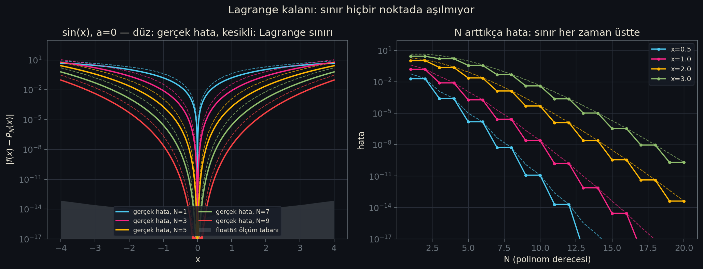
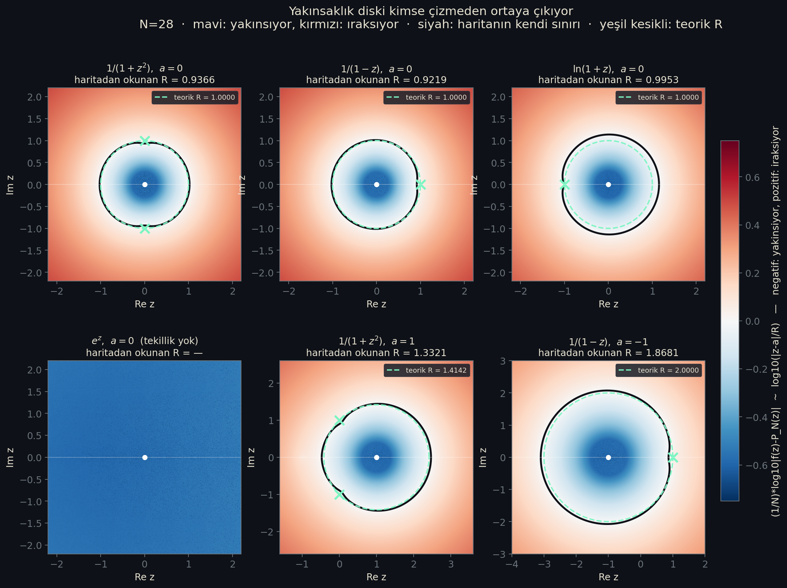
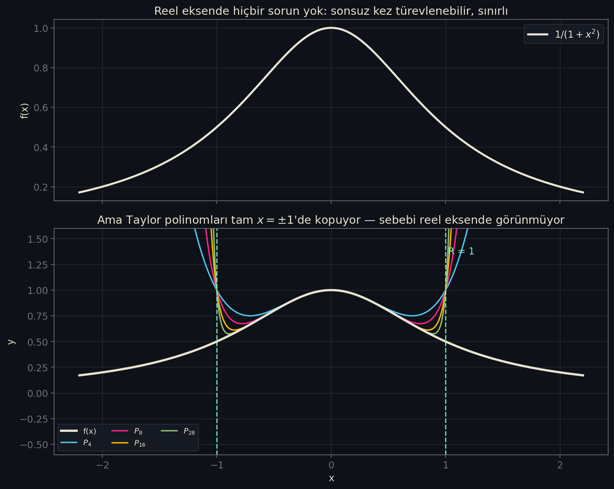
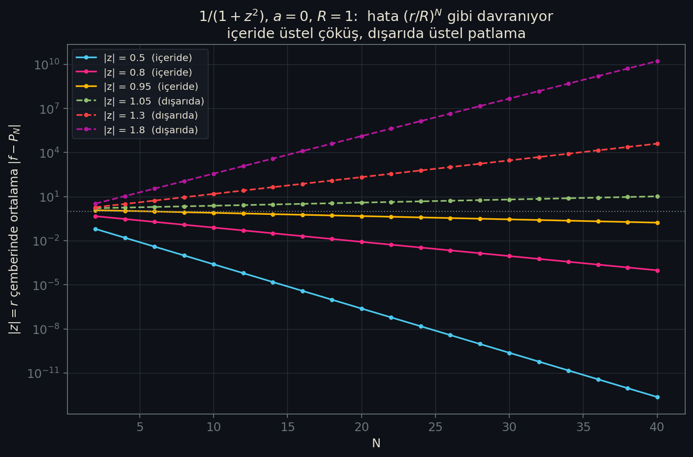
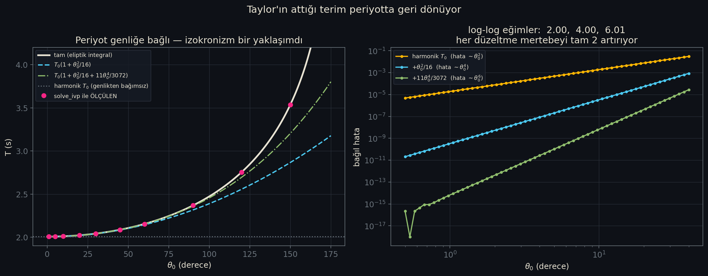
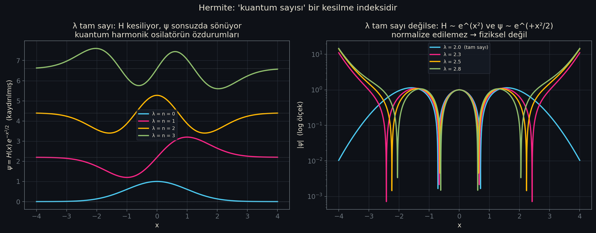
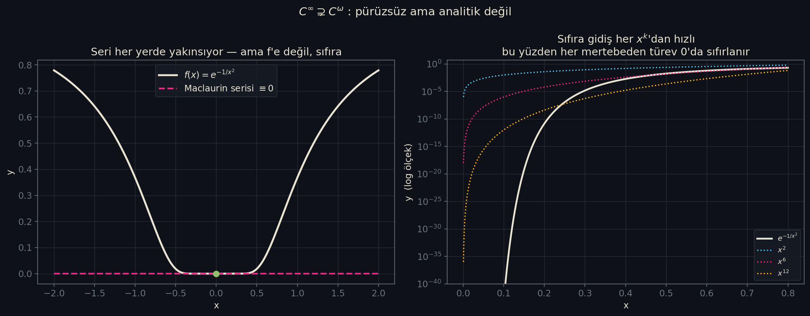

# Taylor Laboratuvarı

Taylor serisi bir hesap tekniği değildir. Bir fonksiyonun bir nokta
civarındaki davranışının **tam muhasebesidir**: serinin her terimi bir
bilgi taşır, kesme işlemiyle atılan her terimin faturası da mutlaka bir
yerde kesilir. Bu depo o faturaların nerede kesildiğini gösterir.

Tez tek cümlede:

> Atılan terim yok olmaz. Ya hatada, ya yakınsaklık yarıçapında, ya
> periyodun genliğe bağımlılığında, ya da bir enerji seviyesinin tam
> sayı çıkmasında geri döner.

Depo yedi katmandan oluşur ve hepsi **aynı** sayılara farklı yollardan
varır: sayısal betikler, sembolik hesap, biçimsel ispat, animasyon,
tarayıcı ve oyun motoru.

## Deponun kuralı

**Çalıştırılmamış hiçbir şey için "çalışıyor" denmez.**

Bu README'de bir şeyin doğrulandığı yazıyorsa, [Doğrulama
durumu](#doğrulama-durumu) bölümünde o komutun bu makinede çalıştırılmış
hâli vardır. Doğrulanamayan şeyler de aynı açıklıkla yazılmıştır —
örneğin MATLAB bu makinede kurulu ve lisanslıdır ama **açılmaz**, bu
yüzden `.m` dosyaları için "MATLAB'da çalışıyor" denmez.

---

## Klasör haritası

| Klasör | İçerik |
|---|---|
| `00-teori/` | LaTeX teorik metni (8 sayfa) ve dört atomik Obsidian notu; teoremlerin ifadeleri ve ispat taslakları. |
| `01-manim/` | Altı Manim sahnesi — serinin davranışını animasyonla gösteren görsel katman. |
| `02-python/` | Sayısal laboratuvarın çekirdeği: yedi betik ve bir defter; `out/` altındaki bütün tablo ve görselleri bunlar üretir. |
| `03-matlab-octave/` | Aynı ölçümlerin MATLAB uyumlu alt kümede bağımsız ikinci uygulaması; Octave ile çalıştırılır. |
| `04-lean/` | Lean 4 + Mathlib biçimsel katmanı: yedi teorem, sıfır `sorry`. |
| `05-godot/` | Godot 4 ile iki etkileşimli sahne — polinomu ve dengeyi elle kurcalamak için. |
| `06-web/` | Tek dosyalık etkileşimli sürüm (üç panel), bağımlılığı yok. |
| `out/` | Üretilen çıktılar: 7 tablo, 10 görsel, 6 video, teori PDF'i. |

---

## Öne çıkan sonuçlar

### 1. Lagrange sınırı 144 096 noktada tarandı ve bir kez bile ihlal edilmedi

`out/tablolar/kalan_dogrulama.md`

| fonksiyon      | a      | aralık      | taranan nokta | float64 aday ihlal | en kötü oran | nerede | yuvarlama rejimi |
|----------------|--------|-------------|---------------|--------------------|--------------|--------|------------------|
| sin(x)         | 0      | [-4, 4]     | 18 012        | 187                | 1.0506       | N=8    | 502              |
| cos(x)         | 0      | [-4, 4]     | 18 012        | 261                | 1.0178       | N=7    | 580              |
| exp(x)         | 0      | [-3, 3]     | 18 012        | 360                | 1.0107       | N=4    | 717              |
| ln(1+x)        | 0      | [-0.85, 2]  | 18 012        | 177                | 2.3593       | N=7    | 272              |
| 1/(1-x)        | 0      | [-0.9, 0.9] | 18 012        | 249                | 0.9988       | N=3    | 474              |
| sqrt(1+x)      | 0      | [-0.7, 2]   | 18 012        | 242                | 1.0550       | N=5    | 484              |
| sin(x), a=pi/4 | 0.7854 | [-3, 3]     | 18 012        | 377                | 1.0121       | N=7    | 715              |
| exp(x), a=1    | 1      | [-2, 4]     | 18 012        | 371                | 1.0147       | N=4    | 717              |

**Toplam: 144 096 nokta, 2224 aday ihlal, mpmath ile TEYİT EDİLEN ihlal: 0.**

Bu tablonun kalbi `aday` ile `teyit edilmiş` arasındaki ayrımdır. Gerçek
hata sınırın çok altına indiğinde float64 kendi ölçüm tabanına
(`eps·|f| ≈ 1e-16`) takılır ve sınırdan büyük *görünür*. Bu 2224 adayın
tamamı mpmath ile 60 basamakta yeniden ölçüldü; hepsinde oran 1'in altına
döndü. Aşılan şey teorem değil, **ölçüm aletiydi** — ve hüküm float64'e
bırakılmadı.



### 2. Lagrange kalanındaki ξ arandı ve bulundu — yarıçapın dışında bile

`out/tablolar/ksi_varligi.md`

| fonksiyon | N | x    | bulunan ksi   | (a,x) içinde mi? | eşitlik artığı |
|-----------|---|------|---------------|------------------|----------------|
| sin(x)    | 3 | 1.2  | 0.2340652903  | evet             | 0.00e+00       |
| sin(x)    | 6 | 2.5  | 0.4079533252  | evet             | 0.00e+00       |
| exp(x)    | 4 | 1    | 0.1771577599  | evet             | 0.00e+00       |
| exp(x)    | 4 | -1.5 | -0.2294380888 | evet             | 0.00e+00       |
| ln(1+x)   | 5 | 0.7  | 0.0809115208  | evet             | 0.00e+00       |
| 1/(1-x)   | 3 | 0.5  | 0.1294494367  | evet             | 0.00e+00       |
| ln(1+x)   | 6 | 1.8  | 0.1435686869  | evet             | 4.22e-15       |

Lagrange kalanı bir eşitsizlik değil **eşitliktir** ve ξ soyut bir varlık
değildir: yukarıdaki değerler tek tek aranıp bulundu, son sütun eşitliğin
iki yanı arasındaki farktır. Son satır özellikle önemlidir — `ln(1+x)`
için `x=1.8` noktası yakınsaklık yarıçapının (R=1) **dışındadır**, seri
orada ıraksar, ama sonlu N için eşitlik hâlâ geçerlidir ve ξ hâlâ vardır.
**Taylor polinomu ile Taylor serisi aynı şey değildir.**

### 3. Yakınsaklık diski çizilmedi — veriden çıktı

`out/tablolar/kompleks_yaricap.md`

| durum                     | a  | tekillikler | teorik R | haritadan okunan R |
|---------------------------|----|-------------|----------|--------------------|
| 1/(1+z^2),  a=0           | 0  | 0+1j, -0-1j | 1.0000   | 0.9366             |
| 1/(1-z),  a=0             | 0  | 1+0j        | 1.0000   | 0.9219             |
| ln(1+z),  a=0             | 0  | -1+0j       | 1.0000   | 0.9953             |
| e^z,  a=0  (tekillik yok) | 0  | yok         | ∞        | —                  |
| 1/(1+z^2),  a=1           | 1  | 0+1j, -0-1j | 1.4142   | 1.3321             |
| 1/(1-z),  a=-1            | -1 | 1+0j        | 2.0000   | 1.8681             |

Sağdaki sütun teorik değere hiç bakılmadan elde edildi: kompleks düzlemde
`(1/N)·log10|f(z) − P_28(z)|` haritalandı ve bu büyüklüğün **kendi sıfır
düzeyi** ölçüldü. Disk haritaya çizilmedi, hatanın davranışından doğdu.
Son iki satır işin özüdür: fonksiyon aynı, merkez farklı, yarıçap farklı —
**yarıçap fonksiyonun değil, (fonksiyon, merkez) çiftinin özelliğidir.**
Okunan değerlerin teorik R'nin %5–8 altında kalması hata değil, sonlu N'in
dürüst payıdır.



Aynı fonksiyonun reel eksendeki görüntüsü hiçbir şey ele vermez:



### 4. Aynı yarıçap, yalnızca katsayılara bakılarak ikinci kez bulundu

`out/tablolar/cauchy_hadamard.md`

| fonksiyon      | a  | teorik R | C-H kestirimi | C-H hatası | oran testi | oran hatası |
|----------------|----|----------|---------------|------------|------------|-------------|
| exp(x)         | 0  | ∞        | 19.1121       | —          | 60.0000    | —           |
| sin(x)         | 0  | ∞        | 14.6525       | —          | 58.4979    | —           |
| ln(1+x)        | 0  | 1.0000   | 1.0706        | 7.06%      | 1.0169     | 1.69%       |
| 1/(1-x)        | 0  | 1.0000   | 1.0000        | 0.00%      | 1.0000     | 0.00%       |
| 1/(1+x^2)      | 0  | 1.0000   | 1.0000        | 0.00%      | 1.0000     | 0.00%       |
| arctan(x)      | 0  | 1.0000   | 1.0716        | 7.16%      | 1.0174     | 1.74%       |
| sqrt(1+x)      | 0  | 1.0000   | 1.1313        | 13.13%     | 1.0256     | 2.56%       |
| 1/(1+x^2), a=1 | 1  | 1.4142   | 1.3907        | 1.66%      | 1.0938     | 22.66%      |
| 1/(1-x), a=-1  | -1 | 2.0000   | 2.0232        | 1.16%      | 2.0000     | 0.00%       |

Bu tablodaki R değerleri fonksiyonun kompleks düzlemdeki tekilliklerine
**hiç bakılmadan**, yalnızca katsayı dizisinden `1/R = limsup |a_n|^(1/n)`
ile kestirildi. Bir önceki tablo aynı sayılara tekilliklerin
geometrisinden ulaşıyordu; Cauchy-Hadamard teoremi tam olarak bu iki
bağımsız yolun her zaman buluştuğunu söyler. Son satırlardan biri
teoremin neden `limit` değil `limsup` ile kurulduğunu gösterir: `a=1` için
en yakın iki tekillik eşit uzaklıkta ama farklı yöndedir, katsayılar
salınır ve oran testi %22,66 sapar — limsup ise yine doğru cevabı verir.



### 5. Küçük açı yaklaşımının faturası: 150°'de tahmin %76 yanlış

`out/tablolar/sarkac.md` — `g = 9.80665 m/s²`, `L = 1.0 m`, `T₀ = 2.006409 s`

| θ₀   | harmonik T₀ | ölçülen T | eliptik T | T₀(1+θ₀²/16) | Taylor-2 hatası | Taylor-4 hatası |
|------|-------------|-----------|-----------|--------------|-----------------|-----------------|
| 1°   | 2.006409    | 2.006447  | 2.006447  | 2.006447     | 0.0000%         | 0.0000%         |
| 10°  | 2.006409    | 2.010236  | 2.010236  | 2.010229     | 0.0003%         | 0.0000%         |
| 30°  | 2.006409    | 2.041338  | 2.041338  | 2.040789     | 0.0269%         | 0.0005%         |
| 60°  | 2.006409    | 2.153242  | 2.153242  | 2.143926     | 0.4326%         | 0.0314%         |
| 90°  | 2.006409    | 2.368246  | 2.368246  | 2.315823     | 2.2136%         | 0.3667%         |
| 120° | 2.006409    | 2.754560  | 2.754560  | 2.556478     | 7.1911%         | 2.1726%         |
| 150° | 2.006409    | 3.535702  | 3.535702  | 2.865891     | 18.9442%        | 9.3989%         |
| 170° | 2.006409    | 4.894360  | 4.894360  | 3.110366     | 36.4500%        | 25.0737%        |

`sin θ ≈ θ` yaklaşımı `−θ³/6` terimini atar. Harmonik osilatörde periyot
genlikten bağımsızdır (izokronizm) — `harmonik T₀` sütunu sabittir.
Gerçek sarkaçta ise 150°'de gerçek periyot 3,54 s, harmonik tahmin ise
hâlâ 2,01 s: **tahmin %76 yanlıştır.** Atılan terim yok olmadı,
periyodun genliğe bağımlılığı (anharmonisite) olarak geri döndü.
Sayısal çözücü ile kapalı eliptik biçim arasındaki en büyük fark
`1.3e-11%` — yani tablodaki her fark Taylor kesmesinden gelir, sayısal
hatadan değil.



### 6. Kuantizasyon fizikten değil, yakınsaklıktan doğuyor

`out/tablolar/frobenius.md` — Hermite denklemi, `ψ = H(x)·e^(−x²/2)`

| λ   | seri kesiliyor mu? | H(4)        | ψ(4) = H(4)·e⁻⁸ | durum                |
|-----|--------------------|-------------|-----------------|----------------------|
| 0   | evet, derece 0     | 1.0000e+00  | 3.3546e-04      | normalize edilebilir |
| 1   | evet, derece 1     | 4.0000e+00  | 1.3419e-03      | normalize edilebilir |
| 2   | evet, derece 2     | -3.1000e+01 | -1.0399e-02     | normalize edilebilir |
| 3   | evet, derece 3     | -3.8667e+01 | -1.2971e-02     | normalize edilebilir |
| 2.5 | HAYIR              | 4.2513e+04  | 1.4261e+01      | PATLIYOR             |
| 3.7 | HAYIR              | 1.0531e+04  | 3.5328e+00      | PATLIYOR             |

Bu bölüm laboratuvarın geri kalanının tersini yapar: diğer betiklerde
bilinen bir fonksiyonun serisi çıkarılıyordu, burada **seri önce gelir**,
fonksiyon ondan doğar. Rekürans `a_{n+2} = 2(n−λ)/[(n+1)(n+2)]·a_n`
λ üzerinde hiçbir kısıt koymaz; kısıt, çözümün sonlu kalması
zorunluluğundan gelir ve bu ancak payın sıfırlanmasıyla, yani `λ = n`
tam sayı olduğunda mümkündür. `E_n = ℏω(n + ½)` formülündeki `n`,
**bu rekürans hangi indekste sıfırlandıysa odur.** Kimse dayatmadı; seri
başka seçenek bırakmadı. Kesilen serilerin her biri ayrıca sympy ile
denkleme konuldu ve kalıntının tam sıfır olduğu doğrulandı.



### 7. Pürüzsüz ama analitik değil

`out/tablolar/analitik_degil.md` — `f(x) = e^(−1/x²)`

Bütün türevleri `x=0`'da sıfırdır (sembolik limitle hesaplandı, sayısal
türevle değil). Maclaurin serisi bu yüzden `0 + 0·x + 0·x² + … = 0`
olur ve **her x için yakınsar** — yarıçap sonsuzdur. Ama yakınsadığı şey
sıfır fonksiyonudur, oysa `f(x) ≠ 0` her `x ≠ 0` için.

> Bir Taylor serisinin yakınsaması, onu üreten fonksiyona yakınsaması
> anlamına gelmez.

Sebep yine kompleks düzlemdedir: `z = iy` boyunca `e^(+1/y²) → ∞`, yani
`z=0` bir **esas tekilliktir**. `C^ω ⊊ C^∞` içermesinin somut tanığı.



---

## Videolar

`out/videolar/` altında altı Manim sahnesi var (1920×1080, 60 fps, toplam
~18 MB). GitHub markdown `.mp4` dosyasını satır içi oynatmaz; aşağıdaki
bağlantılar dosyayı indirir veya tarayıcıda açar.

| Sahne | Süre | Konu |
|---|---|---|
| [1-ArtanDereceSahnesi.mp4](out/videolar/1-ArtanDereceSahnesi.mp4) | 25,3 sn | Derece arttıkça polinom fonksiyonu nereye kadar takip eder, nerede bırakır. |
| [2-TuretmeSahnesi.mp4](out/videolar/2-TuretmeSahnesi.mp4) | 40,3 sn | Katsayılardaki `n!` bir süsleme değil, türevleri eşitleme zorunluluğudur. |
| [3-KalanTerimiSahnesi.mp4](out/videolar/3-KalanTerimiSahnesi.mp4) | 33,7 sn | Lagrange kalanı ve içindeki ξ'nin gerçekten var olması. |
| [4-KompleksYaricapSahnesi.mp4](out/videolar/4-KompleksYaricapSahnesi.mp4) | 57,9 sn | Reel eksende görünmeyen tekillik yarıçapı nasıl belirler. |
| [5-AnalitikDegilSahnesi.mp4](out/videolar/5-AnalitikDegilSahnesi.mp4) | 47,1 sn | `e^(−1/x²)`: pürüzsüz, ama kendi serisiyle temsil edilemiyor. |
| [6-DengeSahnesi.mp4](out/videolar/6-DengeSahnesi.mp4) | 54,9 sn | Her kararlı denge neden harmonik osilatördür — doğa seçmiyor, Taylor bırakmıyor. |

---

## Kurulum ve çalıştırma

### İki ayrı sanal ortam var — karıştırmayın

| Ortam | Python | Ne için | Neden ayrı |
|---|---|---|---|
| `.venv/` | 3.14.7 | numpy / scipy / sympy / matplotlib / mpmath — **bütün sayısal betikler** | sistemin Python'ı |
| `.venv313/` | 3.13.15 | **yalnızca manim** | `manim 0.19.0`, `av<14` istiyor; `av`'nin Python 3.14 tekerleği yok, kaynaktan derleme de `libavformat` başlıklarında düşüyor |

```bash
cd taylor-lab
source .venv/bin/activate            # sayısal betikler
export PATH="$HOME/.elan/bin:$PATH"  # lean / lake
```

Manim'i **kendi** ortamında çalıştırın:

```bash
PATH="$PWD/.venv313/bin:$PATH" bash 01-manim/render.sh 1
```

### Katman katman çalıştırma

```bash
# Sayısal laboratuvar — out/ altındaki tablo ve görselleri üretir
python 02-python/src/kalan_dogrulama.py

# Manim sahneleri (yukarıdaki .venv313 uyarısına dikkat)
bash 01-manim/render.sh

# Teori metni -> 8 sayfalık PDF
# ÜÇ geçiş gerekir: temiz bir dizinde iki geçiş sonunda hâlâ
# "Label(s) may have changed" uyarısı kalıyor. Kısayolu: make teori
make teori

# MATLAB uyumlu katman, Octave ile
cd 03-matlab-octave && octave-cli --no-gui --quiet demo_calistir.m

# Biçimsel katman (ilk derleme Mathlib'i indirir, uzun sürer)
cd 04-lean && lake build

# Etkileşimli sahneler
godot --path 05-godot

# Testler (hiçbiri pencere açmaz)
node 06-web/test_matematik.mjs
godot --headless --path 05-godot --script res://test_dogrulama.gd
```

Web sürümü `file://` ile Chrome'da açılmaz; yerel sunucu gerekir:

```bash
python3 -m http.server 8765
# sonra tarayıcıda: http://localhost:8765/06-web/index.html
```

---

## Doğrulama durumu

Aşağıdaki tablo bu makinede (Fedora Linux 44, x86_64, glibc 2.43) fiilen
çalıştırılmış komutları listeler. Çalıştırılmamış olanlar da yazılmıştır.

| Katman | Komut | Sonuç |
|---|---|---|
| Python çekirdek | `python 02-python/src/taylor.py` | Geçti — "Tüm kontroller geçti.", çıkış kodu 0 |
| Python kalan doğrulama | `python 02-python/src/kalan_dogrulama.py` | Geçti — çıkış kodu 0, 11,7 sn, görsel + 2 tablo yeniden üretildi |
| LaTeX | `pdflatex` (3 geçiş) | Geçti — 0 hata / 0 uyarı, 8 sayfa |
| Manim | `bash 01-manim/render.sh 1` (`-qh`) | Geçti — 25,25 sn · 1920×1080 · 60 fps |
| Manim (çıktı denetimi) | `ffprobe out/videolar/*.mp4` | Geçti — 6 videonun altısı da 1920×1080 @ 60 fps |
| Octave | `octave-cli --no-gui --quiet demo_calistir.m` | Geçti — çıkış kodu 0; okunan R değerleri Python katmanıyla bağımsız olarak örtüştü |
| MATLAB | `matlab -batch "disp(version)"` | **Başarısız** — R2026a kurulu ve lisanslı, ama yorumlayıcı başlamadan çöküyor (LXE builtin registry hatası) |
| Lean | `cd 04-lean && lake build` | Geçti — 2777 iş, hatasız |
| Lean eksen denetimi | `#print axioms` × 7 teorem | Geçti — yalnız `propext`, `Classical.choice`, `Quot.sound`; **`sorryAx` yok**, `grep -rn sorry` boş |
| Web matematik çekirdeği | `node 06-web/test_matematik.mjs` | Geçti — **34/34**; sarkaç periyotları `sarkac.py` ile 7 haneye kadar aynı |
| Web arayüz | Chrome'da `06-web/index.html` | Geçti — üç panelin üçü de çalıştı, konsol hatası yok |
| Godot (matematik) | `godot --headless --script res://test_dogrulama.gd` | Geçti — **30/30** kontrol; katsayılar ve sarkaç periyotları Python katmanıyla aynı |
| Godot (sahne yükleme) | `godot --headless --quit-after 90` × 2 sahne | Geçti — ikisi de 90 kare hatasız koştu |
| Godot (görüntü) | — | **Doğrulanmadı** — `--headless` çizim yapmaz; sahnelerin nasıl göründüğü gözle denetlenmedi |

### MATLAB hakkında açık kayıt

MATLAB R2026a bu makinede **kurulu ve lisanslıdır**, ancak
`matlab -batch` yorumlayıcı başlamadan çöker (`-nojvm -nodisplay` ve
`MW_DISABLE_LXE=1` de aynı sonucu verir). Sebep lisans değil, Fedora 44'ün
glibc 2.43 / GCC 16 tabanının MathWorks'ün desteklediğinin ilerisinde
olmasıdır.

Bu yüzden `03-matlab-octave/` için depo şunu söyler ve fazlasını söylemez:

> Dosyalar MATLAB uyumlu alt kümede yazıldı (`fprintf`, `~`, `%`, düz
> `end`, dosya başına bir ana fonksiyon) ve **GNU Octave 10.3.0 ile
> çalıştırılıp doğrulandı**. MATLAB'da çalıştıkları bu makinede
> gösterilememiştir.

### Platformlar arası sayısal fark

`kalan_dogrulama.py` Windows 11 / Python 3.13.7 üzerinde 2232, Fedora 44 /
Python 3.14.7 üzerinde 2224 aday ihlal buldu. Aday sayısı platformun
`libm`'ine (`sin`, `exp`, `log` son bit yuvarlamaları) bağlı olduğu için
birkaç birim oynar. Asıl iddia olan **mpmath ile teyit edilen ihlal = 0**
her iki platformda da aynı çıktı.

---

## Ayrıntılı belgeler

| Dosya | İçerik |
|---|---|
| `DEVAM.md` | Projenin güncel durumu, sıradaki iş kuyruğu, bilinen tuzaklar. |
| `ENVANTER.md` | Windows ve Fedora makinelerinin araç envanteri; neyin gerçekten çalıştırıldığı. |
| `RAPOR.md` | Ne çalıştı, ne çalışmadı, hangi araç yoktu; bulunan ve düzeltilen sekiz gerçek hata. |
| `LEAN-DURUM.md` | Biçimsel katmanın durumu: 7 teorem, 0 `sorry`, kapsam dışı bırakılan 4 konu. |
| `out/taylor-teori.pdf` | Teorik metnin derlenmiş hâli (8 sayfa). |
